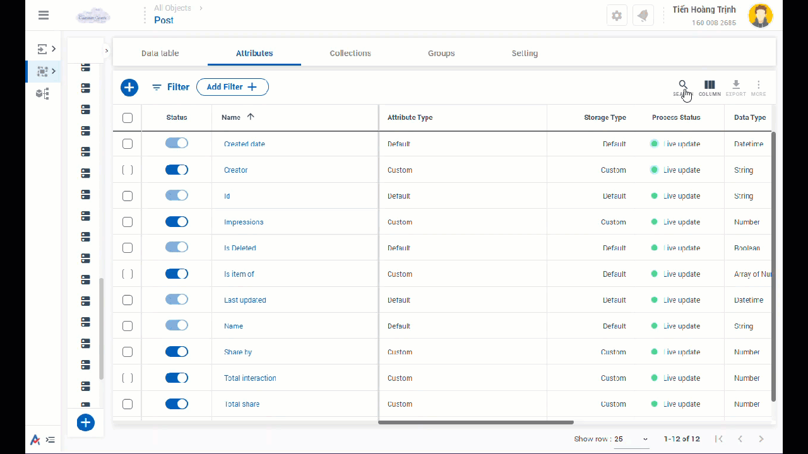
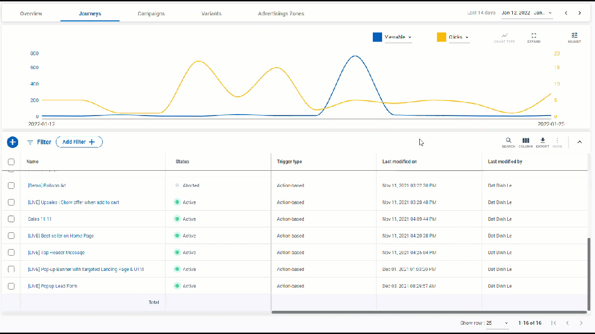

# CDP 365's Interface

## Overview

**CDP 365's Interface** is divided into 3 main parts: Workspace, Horizontal menu and Vertical menu.

### Workspace

The space contains objects of CDP 365 that provides data and interactions. The objects includes: Tabs of apps or subcategories, general tools such as filter, search, column, export and import.&#x20;

.png>)

### Horizontal menu

The menu manages general information related to the account and the current location in CDP 365.

* The left-hand side includes respectively: Main menu of CDP 365, the logo of the Antsomi, and the current app user is using.
* The right-hand side includes respectively: The Help feature, The notification bell, and the logged-in account.

<figure><figcaption>
Horizontal menu
</figcaption></figure>

### Vertical menu

It contains two parts relatively: the recent viewed modules of the logged-in account and main modules of CDP 365.

&#x20;

<figure><figcaption>
Verrtical menu
</figcaption></figure>

## Basic buttons

Basic buttons located in the horizontal menu of the workspace make interactions with CDP 365 productive.

### Filter

Filter helps to save time in viewing data. Click .png>) to start using the button.&#x20;

<figure><figcaption>
Filter
</figcaption></figure>

Filter function is able to:&#x20;

* Filter by various values of an attribute at a time.&#x20;
* Save the set of filters&#x20;
* Reset the data table
* Delete the filter

<figure><figcaption>
Interaction with filter
</figcaption></figure>

### Search

Using  to find the value of an attribute.

<figure><figcaption>
Search 
</figcaption></figure>

There are two types of search you can use:&#x20;

1. Search by string: Enter the character string to search and press Enter&#x20;
2. Search and go to: Enter the string of characters to search and click on the suggestion

### Modify columns

Using  to manage the visibility of attributes in a data table.&#x20;

### Upload data 

To upload values of an attribute has 4 types:&#x20;

* &#x20;Add New and Update&#x20;
* Add New only: adds data into empty values of an attribute&#x20;
* Update only: updates data overwrite with the existing values&#x20;
* Remove: removes existing data&#x20;

A few business objects are available for one uploading type.

<figure><figcaption>
Upload data into a Business Object
</figcaption></figure>

In the configuration of uploading has:

* Matching fields are the required fields to match the uploaded file and the attributes in CDP 365
* Update fields are the attributes receiving the uploaded data&#x20;
* Business Object Attributes are the attributes of CDP 365&#x20;
* Uploaded Columns are the attributes of the uploaded file&#x20;
* Encrypt makes the uploaded data confidential&#x20;
* Allow null means allowing empty values.

<figure><figcaption>
Uploading configuration
</figcaption></figure>

### Export data&#x20;

Allow downloading data from a Business Object by .xlsx, .csv, .xml files.&#x20;

<figure><figcaption>
Download data from a Business Object
</figcaption></figure>

Please follow these steps if you want to download customer data, for example.&#x20;

* Go to Personas >> Customers&#x20;
* Find the Export icon&#x20;
* Click the icon
* Fill in the export information, including

1. File name: the name that you give to the exported data file.
2. File format: which format that you want to download (.csv, .xlsx, .xml).
3. Delimiter type: what type of column break that you want the file to be formed.
4. Compress file: allows you to download a file under .zip format.
5. Exported rows: how many rows that the exported file contains.
6. Exported columns: how many columns that the exported file contains.

**Notices**: If you select .xml format, you are able to edit the schema of the exported file. However, this format is available only in Customer and Visitor data.&#x20;

<figure><figcaption>
Export information
</figcaption></figure>

**Some basic buttons for a statistical overview are provided in some menus.**

<figure><figcaption>
A statistical overview of the Customer Journeys app
</figcaption></figure>

### Time range

Time range provides the date on which the data in the chart below was recorded.

Adjust the time range by clicking .png>) or .png>).

<figure><figcaption>
Time range
</figcaption></figure>

### Chart and Metric

The chart shows the traffic by the time range.&#x20;

The traffic represents the selected metrics.

<figure><figcaption>
Chart and Metric
</figcaption></figure>

### Expand

Expand the chart to enlarge the chart zone.&#x20;

<figure><figcaption>
Expand
</figcaption></figure>

### Adjust

Adjust allows viewing data of the chart by hourly, daily, weekly, monthly, quarterly, or yearly.

<figure><figcaption>
Adjust
</figcaption></figure>

## Account Profile

### Overview

Account profile supports

* Edit profile
* Account name and ID
* Logout the account&#x20;

### Two-step authentication&#x20;

This setting increases the confidentiality of an account.&#x20;

The authentication code is generated by the Google Authentication app.&#x20;

To enable this authentication method, do as follow:

* Go to your account profile&#x20;
* Click _Edit profile_
* Go to _Password_
* Turn on 2-steps authentication

<figure><figcaption>
Account Profile 
</figcaption></figure>

After enabling the authentication, CDP 365 asks for the authentication code for the first login. There are two options to save the code for the next login or to enter the code every time you log in.

If the setting is disabled, CDP 365 asks every time login:&#x20;

1. Skip the authentication. &#x20;
2. Open the Google Authentication app, scan the QR code and add the authentication code. If the authentication is skipped, it is asked for the next login. However, if the authentication code is saved, the authentication is not asked for the next login and the 2-step authentication is enabled. &#x20;

<figure><figcaption>
Authentication
</figcaption></figure>
