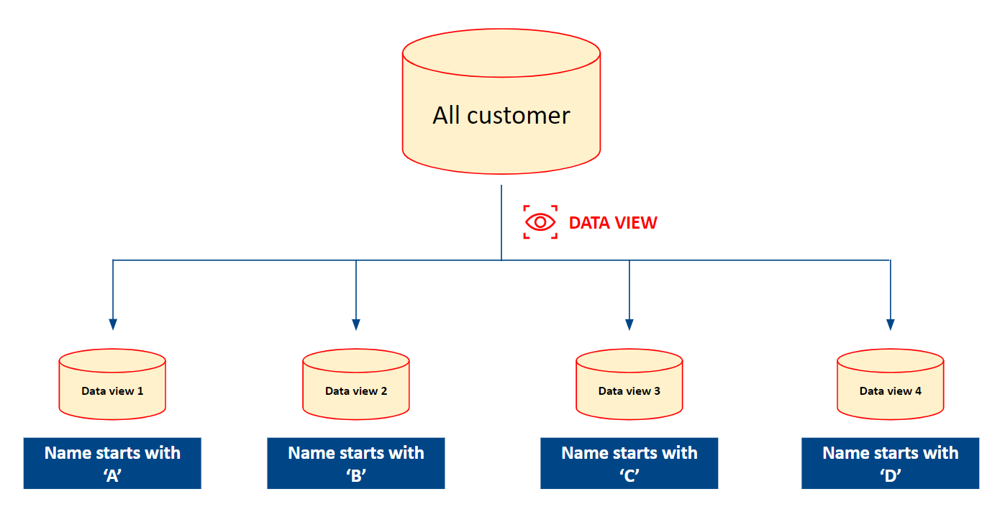

# Data Views

## INTRODUCE

A data view contains a portion or the entirety of data derived from a data object. Data views are employed when an individual only wishes to share specific data from a data object.

**For example**, let's say account 1 creates a new data object called 'All customer.' Subsequently, account 1 generates a data view containing only those customers whose names start with 'A,' utilizing the data from the 'All customer' data object. Similarly, account A also produces additional data views consisting of customer names starting with 'B,' 'C,' 'D,' etc.

<figure><figcaption></figcaption></figure>

## DATA VIEW LISTING INTERFACE

* **Owner View \[1]**: display data views created by user or other accounts (if user has **View everything** permission toward **Data Views** menu)
* **Shared with me \[2]**: display data views shared by other accounts

<figure><figcaption></figcaption></figure>

## CREATE A NEW DATA VIEW

Click  to generate a new data view.

<figure><figcaption></figcaption></figure>

Afterwards, you need to input some necessary information:

* **Name of the data view**: insert a unique name for your data view
* **Description**: describe your data view if desired
* **Based On Data Object**: a data view gets data from a data object. Therefore, you have to choose a data object (popup \[1] only includes data objects you have permission to) for creating a new data view

<figure><figcaption></figcaption></figure>

### Row access

**Row access** feature allows users to define conditions by utilizing selected data object attributes. Subsequently, the system will identify data rows that adapt to these conditions. Let's use **OR/AND** logic to define conditions that suit your needs.

Additionally, we provide you with two options: **All rows** and **Specific rows**. With the former option, the system retrieves the entire dataset of the selected data object. As for the latter option, the system will follow the rules you configure.

<figure><figcaption></figcaption></figure>

### Column access

A data object consists of a wide range of attributes. Therefore, when creating a new data view based on a data object, you need to choose the attributes you want to use for your data view. **Please note that we always require two attributes: ID and Name**. For other attributes, you can rename them to suit your needs.

Similar to **Row access**, we offer two options: **All columns** and **Specific columns**. With **All columns**, the system will include all available columns of the selected data object, while for the **Specific columns** option, only the columns selected by the user will be applied.

<figure><figcaption></figcaption></figure>

### Share access

This feature enables users to share a data view with other accounts.

**Add people**: enter email addresses of accounts you want to invite.

**People with access**: display accounts you invited

* **Viewer**: allows only viewing of the data view and prohibits any modifications
* **Editor**: permits modifications to the configuration of the data view
* **Transfer ownership**: if you wish to change the owner of a data view, you can use this option. Please note that the 'Transfer ownership' option is displayed in the configuration of a data view only if you are the creator of it
* **Remove access**: allows for the deletion of added accounts

<table><thead><tr><th width="518">Permission</th><th width="118" align="center">Viewer</th><th align="center">Editor</th></tr></thead><tbody><tr><td>Search/ filter/ modify column data table</td><td align="center">x</td><td align="center">x</td></tr><tr><td>Search/ filter/ modify column attribute</td><td align="center">x</td><td align="center">x</td></tr><tr><td>View attribute computation histories</td><td align="center">x</td><td align="center">x</td></tr><tr><td>View configuration of existing attribute</td><td align="center">x</td><td align="center">x</td></tr><tr><td>Action toward attribute (change status)</td><td align="center">x</td><td align="center">x</td></tr><tr><td>View configuration of data view</td><td align="center">x</td><td align="center">x</td></tr><tr><td>Modify configuration of data view</td><td align="center">-</td><td align="center">x</td></tr><tr><td>Use data view for segmentation</td><td align="center">x</td><td align="center">x</td></tr><tr><td>Use data view at 'Customer' &#x26; 'Visitor' menu</td><td align="center">x</td><td align="center">x</td></tr></tbody></table>

**General access**

* **Restricted**: share your data view only with accounts added to **People with access**
* **Public**: allows you to share your data view with all accounts

<figure><figcaption></figcaption></figure>

## CHECK YOUR DATA VIEW

**Settings Tab**

<figure><figcaption></figcaption></figure>

**Data Tab**

<figure><figcaption></figcaption></figure>

**Attributes Tab**

<figure><figcaption></figcaption></figure>
