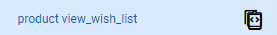

# Event Sources

## Overview

**The demand is to track how many successful orders have been made in a month.**&#x20;

<table><thead><tr><th width="353">Analysis</th><th>Action in CDP 365</th></tr></thead><tbody><tr><td>
To have a successful order, an audience needs to take the action of purchasing. 

That action is an event in CDP 365.
</td><td>Create an <a href="./#events">event</a> representing the purchasing action</td></tr><tr><td>
The number of successful orders isn't insightful enough if it is used in a Marketing campaign. 

Therefore, the data related to audiences, products, etc. are also demanded to make a complete analysis. 
</td><td>Create <a href="./#event-attributes">event attributes</a> indicating audiences, products, etc.</td></tr><tr><td>Besides, these orders occurred from which sources if there are multiple sources generating revenues.</td><td>Create a <a href="./#sources">source </a>defining where these orders made</td></tr></tbody></table>

### Steps of creating a Source&#x20;

&#x20;

<figure><figcaption>
Steps
</figcaption></figure>

* When creating a Source, it is required to assign events to track the interactions of audiences in that domain.&#x20;
* After having events, it is required to assign event attributes for the event to make the event insightful.
* Therefore, when creating a Source should have event attributes and events beforehand.

### Type of creating a new one

There are two options for creating an event attribute, an event, or a source

* 'Create new attribute' is to create a new one
* 'Create from existing attribute' is to create a new one based on the settings of an existing attribute, event, or source in CDP 365. The name and the description are required to change.

## Event attributes

### Create an event attribute

* Click create button
* Select the type of creating
* Set the configuration of event attribute

<figure><figcaption>
Create a new event attribute
</figcaption></figure>

#### The configuration

<figure><figcaption>
The configuration
</figcaption></figure>

The settings of an event attribute include

* Attribute type includes&#x20;
  * Attribute is an event attribute&#x20;
  * Line-item attribute is an event attribute that allows calculating complex formulas
  * For example, quantity and price are event attributes, but the total price of an order is a line-item attribute due to the complexity to calculate the total price. It requires the total quantity multiply the price.
* Attribute name&#x20;
* Attribute internal code is the code generated from the attribute name
* Description&#x20;
* Data type is the data format of values, for example, number, string, text
  * Display as is the specific format of event attributes, for example, if 'data type' is number then 'display as' is percentage, number, or currency
  * Is required is to make the event attribute required field
  * Auto suggestion is to make values of the event attribute automatically suggested when applying it.

<figure><figcaption>
An example of auto suggestion
</figcaption></figure>

## Events

### Create a new event

* Click create button&#x20;
* Select the type of creating
* The settings of a new event include 2 steps
  * Fill event info
  * Assign event attributes

<figure><figcaption>
Create a new event
</figcaption></figure>

#### The configuration

_**Step 1: Fill event info**_

<figure><figcaption>
Step 1: Fill event info
</figcaption></figure>

* Event name
* Description&#x20;
* Event internal name is the code generated by event name
* 'Event action' and 'Event category' define an event. The combination must be unique for each event.
* Icon is the image making management of the event easier

#### _**Step 2: Assign event attributes**_

* Left-hand side propose event attributes and Business Objects having in CDP 365
* Right-hand side contains event attributes and objects are assigned for the event
* Event attributes
* Object reference is Business Objects&#x20;
* Main object is the main Business Object into which the event aims to push data. Each event has one main object. Main object also contains line-item attribute.&#x20;
* Foreign object is a Business Object to which the data of the event relates. An event could have multiple foreign objects.
* For example, the purchase event could have&#x20;
  * Event attributes: quantity, price, etc.&#x20;
  * Main object: Product, the total revenue.
  * Foreign objects: Customers, Promotion, etc.

<figure><figcaption>
Step 2: Assign attributes
</figcaption></figure>

## Sources

### Create a new source

* Click create button&#x20;
* Select the type of creating
* The settings of a new source include
  * Choose source type
  * Fill source info
  * Assign events

<figure><figcaption>
Create a new source
</figcaption></figure>

#### The configuration

#### _**Step 1: Choose source type**_

* Choose the type of source aimed to create
* There are 4 types and the settings of each type are different
  * Websites
  * Mobile App&#x20;
  * Server&#x20;
  * Cloud Service

<figure><figcaption>
Step 1: Choose source type
</figcaption></figure>

#### _**Step 2: Fill source info**_

* Source name
* Description&#x20;
* Domain: starts with _**http://**_ or _**https://**_ if the source type is a website&#x20;
* Icon: an image represents the source
* Associate with UTM: If selected, it will automatically sync data from UTM to ATM

<figure><figcaption>
Step 2: Fill source info (website)
</figcaption></figure>

#### _**Step 3: Assign event**_

* Choose event template. The event templates proposed by CDP 365 are already assigned event attributes and objects.
* Assign events for source&#x20;
  * Click.png>)to add new a event to the source&#x20;
  * Click .png>) to remove an event/event attribute/object reference&#x20;
* [Choose event attributes and objects](./#step-2-assign-event-attributes)

<figure><figcaption>
Step 3: Assign event
</figcaption></figure>

## Check the new created ones

### Basic functions

#### Remove&#x20;

* Select an event attribute or an event
* Go to EDIT
* Could take action of Remove or Make a copy

_Note: Source can't be removed_

.png>)

#### Duplicate&#x20;

If demanding to create a new event attribute, event, or source from an existing one

* Hover over the selected existing one
* Click Duplicate icon .png>)
* Go to the settings
* Fill the name and the description.

#### Go to the assign setting

Click .png>) to view the final settings (detailed settings of assign) of an event attribute, an event, or a source.

### Event attributes

Click the name of the event to view the settings of the event attribute, and could edit the name and the description.&#x20;

<figure><figcaption>
Event attributes
</figcaption></figure>

### Events

After choosing a specific event to view, you could see 2 tabs:

* Attribute: Showing the list of Event Attributes assigned to it. You are able to adjust this list by clicking the Assign button 

<figure><figcaption>
Attribute tab
</figcaption></figure>

* Setting: Showing the configuration of the event

<figure><figcaption>
Setting
</figcaption></figure>

### Sources

The details of a source include two tabs

* Events tab shows the traffic and the list of events the source has
* Setting tab shows the configuration of the source

#### Events tab

The tab includes 2 parts

* The chart shows traffic of the source in a set Time range
  * **Number Of Rejected:** number of events rejected
  * **Number Of Received:** number of events received&#x20;
* The list of events assigned in the source

<figure><figcaption>
Events tab
</figcaption></figure>

#### _List of events_

#### _Status_&#x20;

The status shows the ability of tracking data of an event

.png>)means the event doesn't track data

.png>) means the event is tracking data

#### _Name_

Hover over the name of an event 

* Click the name to view [detailed traffic and event attributes of an event](./#details-of-an-event-in-a-source)
* Click .png>) to get the tracking script of event. Tracking script is a technical term that must be added to the source code for an event to start tracking data from the source.

#### _Details of an event in a source_

The details include 3 tabs

* **Event log**: Shows the traffic the event received or rejected

<figure><figcaption>
Event Log
</figcaption></figure>

* **Event Attributes**: To point out the list of event attributes assigned to it and make any adjustment you want. By using the status toggle, these attributes could be enabled or disabled to track data.&#x20;

<figure><figcaption>
Event Attributes
</figcaption></figure>

* **Event Settings:** To optimize the performance of CDP 365 and better manage the data from events in a specific Event Source

<figure><figcaption>
Event Settings
</figcaption></figure>

* _Priority Streaming:_ To choose which event is prior to be recorded the data. If it's on, the event will be recorded realtime. And if not, there will be a certain delay (not too long) to record the event.
* _Used for product recommendation:_ It allow users to determine whether the event data is used in recommending product&#x20;
* _Streaming to Customer Journeys:_ Users are able to choose which events will be used in Customer Journeys. This option is only displayed in events assigned in the Event Sources of [Server type](./#step-1-choose-source-type). For the Website & Application type, the events are automatically added in the Customer Journeys.
* _Record event data in Visitors/ Customers profiles:_ Only the events having this option turned on could be display in Visitors/ Customers profiles

#### Setting tab

In the setting tab, not only the configuration of the source but also the tracking script (if the source is a website).&#x20;

The tracking script is a technical term that must be added to the source code to start tracking data from the domain.

<figure><figcaption>
Setting tab
</figcaption></figure>

Here are the articles in this section:


[Broken link](broken-reference)

