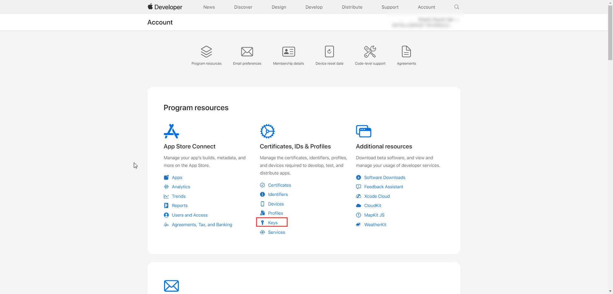
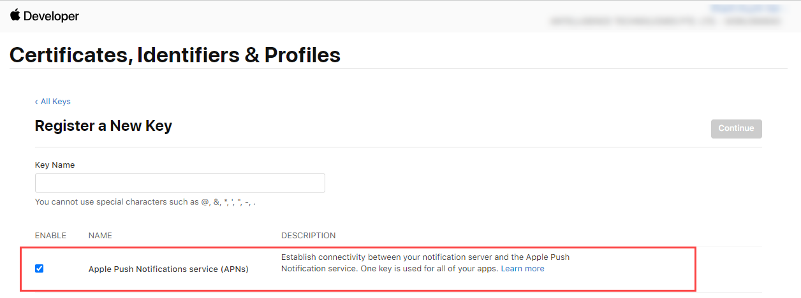

# App Push Notification

## I - Introduction

App Notification is a channel that allows you to push notifications to engage your app users using third-party vendors or Antsomi provided destination.

## II - Details

This document provides you the meaning of Configure fields for each catalog (vendor) and instruct you how to take those information

### 1. Antsomi App Push

<figure><figcaption></figcaption></figure>

**APNs Setting - Configuration for IOS**

APNs (Apple Push Notification Service) Authentication Type: The default option is .p8 Auth Key

<table><thead><tr><th width="185">Field's name</th><th>Description</th></tr></thead><tbody><tr><td>Key .p8 file</td><td>The .p8 file contains the authentication token signing key and is provided by Apple. You could input to the text box or upload a file by clicking icon .</td></tr><tr><td>Key ID</td><td>Identifier ID for the Authentication Key</td></tr><tr><td>Team ID</td><td>Team ID provided by Apple for developer accounts</td></tr><tr><td>App Bundle ID</td><td>Bundle identifier uniquely identifies your application in Apple's ecosystem</td></tr></tbody></table>

To take the information of these fields, you need:

* iOS mobile app
* Paid Apple Developer Account with **Admin** Role.

Follow theses following steps:

* Open your Apple Developer Account and and navigate to **Certificates, Identifiers & Profiles** > **Keys**&#x20;

<figure><figcaption></figcaption></figure>

* Select the Key button

<figure><figcaption></figcaption></figure>

* Select **Apple Push Notifications service (APNs)**, and enter a name for the key --> Select **Continue** and on the next page, select **Register**. After that, download this key and click **Done**\

<figure><figcaption></figcaption></figure>


You can have up to two .p8 keys in your Apple account. If you need to generate a third key, you will need to revoke one of your existing keys.


* For Key ID & Team ID, choose a specific key and copy the corresponding value then paste to CDP 365.

<figure><figcaption></figcaption></figure>

* For App Bundle ID, navigate **Certificates, Identifiers & Profiles** > **Identifiers** and copy Bundle ID

<figure><figcaption></figcaption></figure>

**FCM Setting - Configuration for Android**

<table><thead><tr><th width="207">Fields</th><th>Description</th></tr></thead><tbody><tr><td>Service Account (JSON File)</td><td>This is a private key file generated from the Google Cloud Console for your Firebase project. It contains the necessary credentials to authenticate and send messages via FCM. Here's how to get it: - Go to the <strong>Google Cloud Console.</strong>  - Navigate to <strong>IAM &#x26; Admin</strong> > <strong>Service Accounts</strong>.  - Create a new service account or select an existing one.  - Generate a new <strong>JSON key file</strong> and download it. This file typically contains your project's private key and other credentials in JSON format.</td></tr><tr><td>Sender ID</td><td>The Sender ID of your project on Firebase</td></tr></tbody></table>

To take the Sender ID on Firebase, you must create a project before, to do so, read the document [here](https://firebase.google.com/docs/android/setup?authuser=0\&hl=en). After having a project, do as following to take out the necessary information:

* Login to your account on Firebase at this link: [https://console.firebase.google.com/](https://console.firebase.google.com/)
* Choose a project

<figure><figcaption></figcaption></figure>

* Choose an app&#x20;

<figure><figcaption></figcaption></figure>


If you have not created any app, click Add app and choose the SDK (This SDK must be the same with the [configuration of Destination on CDP 365](https://docs.antsomi.com/cdp-365-user-guide-en/use-cases/marketing-hub/how-to-setup-a-campaign-using-app-notification-channel#step-3-select-sdk). \



* Click on the Cloud Messaging tab -> Copy the Sender ID, then paste to CDP 365

<figure><figcaption></figcaption></figure>

### 2. One Signal

<figure><figcaption></figcaption></figure>

| Field          | Description                                                                                                                                                                                                            |
| -------------- | ---------------------------------------------------------------------------------------------------------------------------------------------------------------------------------------------------------------------- |
| App ID         | ​[Get your App ID and secret key](https://app.gitbook.com/o/-LzunofLVjpTa_-p1PQt/s/mECwNqMNUmu6OXHSYgDv/quick-start-guide/how-to-push-notification-using-onesignal-app-push-in-cdp-365#get-your-app-id-and-secret-key) |
| App Secret Key | [Get your App ID and secret key](https://app.gitbook.com/o/-LzunofLVjpTa_-p1PQt/s/mECwNqMNUmu6OXHSYgDv/quick-start-guide/how-to-push-notification-using-onesignal-app-push-in-cdp-365#get-your-app-id-and-secret-key)  |
| User Id        | 
Click the  icon to add Personalization

                      |
