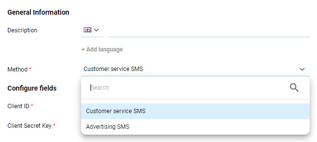
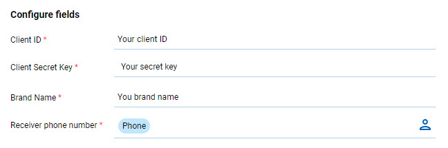

# SMS

Basically, to send SMS to your audience, you have to create a Destination and then create a Customer Journey ([See example](https://docs.antsomi.com/cdp-365-user-guide-en/use-cases/marketing-hub/how-to-send-messages-using-oneway-sms-destination)). Each destination has its unique required set of fields that needed to filled correctly in order to be authenticated.

## SMS FPT

FPT's SMS Brandname service allows businesses to send personalized messages to their customers using the company’s registered brand name as the sender, instead of a generic phone number. This enhances brand recognition and credibility, helping businesses build trust and maintain a professional image in customer communications.

There are two types of SMS services: **Customer Service SMS** and **Advertising SMS**

<figure><figcaption></figcaption></figure>

* **Customer Service SMS** focuses on delivering essential, personalized updates, notifications, and support to customers.
* **Advertising SMS** is designed for marketing and promotional purposes, helping to engage current customers and attract new users.

To use this destination, please provide the following information:

<figure><figcaption></figcaption></figure>

<table><thead><tr><th width="222">Field</th><th>Description</th></tr></thead><tbody><tr><td>Client ID</td><td>The unique identifier provided by the FPT vendor</td></tr><tr><td>Client secret key</td><td>The secret key associated with your Client ID, provided by the vendor</td></tr><tr><td>Brand name</td><td>The name of your brand registered with the vendor</td></tr><tr><td>Receiver phone number</td><td>The field containing the customer’s phone number</td></tr></tbody></table>

## Incom SMS

<figure><figcaption></figcaption></figure>

<table><thead><tr><th width="229">Field</th><th>Description</th></tr></thead><tbody><tr><td>Username</td><td>Account Name Registered Service Provider</td></tr><tr><td>Password</td><td>The password of the account registered with the service provider</td></tr><tr><td>Prefix id</td><td>Service number is the number that INCOM owns: 6x89, 996, 997, 998, 19001255, .. is the Brandname of the registered customer if sending customer service</td></tr><tr><td>Command code</td><td>Service code</td></tr><tr><td>Country Code (Ex: 84)</td><td>Area code for the country</td></tr><tr><td>Phone number</td><td>Phone number of the SMS recipient</td></tr></tbody></table>

## SMS Wavecell

<figure><figcaption></figcaption></figure>

<table><thead><tr><th width="242">Field</th><th>Description</th></tr></thead><tbody><tr><td>Source</td><td>ID of the customer who has registered for the service</td></tr><tr><td>Destination</td><td>The recipient's phone number.</td></tr><tr><td>API Key</td><td>A piece of code that needs to be passed to verify the right to use the API</td></tr><tr><td>Sub Account ID</td><td></td></tr></tbody></table>

## Vivas SMS

<figure><figcaption></figcaption></figure>

<table><thead><tr><th width="240">Field</th><th>Description</th></tr></thead><tbody><tr><td>Username</td><td>Account Name registered for the service</td></tr><tr><td>Password</td><td>Password of the account registered for the service</td></tr><tr><td>Brand name</td><td>Trademark name registered with service provider</td></tr><tr><td>Phone number</td><td>Phone number of the SMS recipient</td></tr></tbody></table>

## SMS Brandname

<figure><figcaption></figcaption></figure>

<table><thead><tr><th width="204">Field</th><th>Description</th></tr></thead><tbody><tr><td>Token</td><td>A piece of code that needs to be passed to verify the right to use the API</td></tr><tr><td>Phone Number</td><td>Phone number of the SMS recipient</td></tr><tr><td>Brand Name</td><td>Brand name registered with service provider</td></tr><tr><td>Type</td><td>Type of message to send (1: Customer care, 6: SMSOrder)</td></tr></tbody></table>

## eSMS SMS

<figure><figcaption></figcaption></figure>

<table><thead><tr><th width="179">Field </th><th>Description</th></tr></thead><tbody><tr><td>API Key</td><td>A piece of code that needs to be passed to verify the right to use the API.  To take this key, go to your eSMS account and choose "Quản lí API" </td></tr><tr><td>Secret Key</td><td>It is provided by eSMS provider, you can also find it with API Key.</td></tr><tr><td>Brand Name</td><td>Brand name registered with service provider</td></tr><tr><td>Phone number</td><td>The receiver's phone number. (For best usage, you should choose personalization so that SMS could be sent to your customer via Customer Journeys )</td></tr></tbody></table>

For this destination, you are able to send Broadcast message - a type of message that are sent to a large number of audience.&#x20;

To do so, locate Delivery Interval Setting and check on the option "Enable Broadcast" and determine the quantity of audience who will receive the message in one time.

<figure><figcaption></figcaption></figure>

## VSMS

<figure><figcaption></figcaption></figure>

<table><thead><tr><th width="201">Field</th><th>Description</th></tr></thead><tbody><tr><td>Username</td><td>Account Name registered for the service</td></tr><tr><td>Password</td><td>Password of the account registered for the service</td></tr><tr><td>Brand name</td><td>Brand name registered with service provider</td></tr><tr><td>Phone number</td><td>Phone number of the SMS recipient</td></tr></tbody></table>

## ANTS SMS

<figure><figcaption></figcaption></figure>

<table><thead><tr><th width="200">Field</th><th>Description</th></tr></thead><tbody><tr><td>Username</td><td>Account Name registered with service provider</td></tr><tr><td>Password</td><td>Password of the account registered for the service</td></tr><tr><td>Brand name</td><td>Brand name registered with service provider</td></tr><tr><td>Phone number</td><td>Phone number of the SMS recipient</td></tr></tbody></table>

## SMS Infobip

<figure><figcaption></figcaption></figure>

<table><thead><tr><th width="225">Field</th><th>Description</th></tr></thead><tbody><tr><td>API Key</td><td>API key that <strong>SMS Infobip</strong> provided you</td></tr><tr><td>Base URL</td><td>Facility that helps the platform identify the originator of each API request</td></tr><tr><td>Brand Name</td><td>Brand name registered with infobip</td></tr><tr><td>Phone number</td><td>Phone number of the SMS recipient</td></tr></tbody></table>

## Noah SMS

<figure><figcaption></figcaption></figure>

<table><thead><tr><th width="199">Field</th><th>Description</th></tr></thead><tbody><tr><td>Username</td><td>The name that you use when accessing the system</td></tr><tr><td>Password</td><td>A secret word or phrase that must be used to gain admission to the system</td></tr><tr><td>Brand name</td><td>Registered brand name</td></tr><tr><td>Share Key</td><td>Used to create a piece of code to ensure that the request of the partner needs to be sent</td></tr><tr><td>Phone number</td><td>Phone number of the SMS recipient</td></tr><tr><td>Country Code</td><td>Area code for the country</td></tr></tbody></table>

## Telerivet SMS

<figure><figcaption></figcaption></figure>

<table><thead><tr><th width="250">Field</th><th>Description</th></tr></thead><tbody><tr><td>API Key</td><td>API key that you generated on <strong>Telerivet SMS</strong>. How to get the API Key</td></tr><tr><td>Project ID</td><td>Project ID corresponding to your API key. How to get the Project ID</td></tr><tr><td>Phone Number</td><td><ul><li>Phone number of the SMS recipient</li><li>You can click theicon to add Personalization </li></ul>

</td></tr></tbody></table>

## Klasik SMS

<figure><figcaption></figcaption></figure>

<table><thead><tr><th width="246">Field</th><th>Description</th></tr></thead><tbody><tr><td>API Key</td><td>API key that <strong>Klasik SMS</strong> provided you</td></tr><tr><td>Country Code (Ex: 84)</td><td>Area code for the country</td></tr><tr><td>Phone Number</td><td><ul><li>Phone number of the SMS recipient</li><li>You can clickto add Personalization</li></ul>

</td></tr></tbody></table>

## SMS LACHONG MEDIA

<figure><figcaption></figcaption></figure>

<table><thead><tr><th width="198">Field</th><th>Description</th></tr></thead><tbody><tr><td>Brandname</td><td>Trademark name registered with service provider</td></tr><tr><td>Username</td><td>Account Name registered for the service</td></tr><tr><td>Password</td><td>Password of the account registered for the service</td></tr><tr><td>Phone number</td><td>Phone number of the SMS recipient</td></tr></tbody></table>
