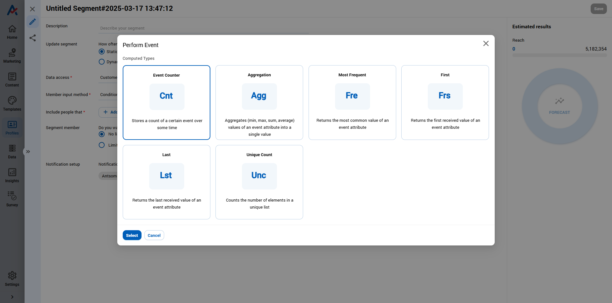

# Status of Journey

#### **In Designed – Designing**

<figure><figcaption></figcaption></figure>

* This status means the Customer Journey/Blast Campaign is still being created and has not yet been activated.
* It occurs when users create or edit a campaign but have not clicked the **“Activate”** button. &#x20;
* You should keep this status while preparing content, defining logic, and performing tests before going live.

***

#### **Scheduled – Scheduled to Start**

<figure><figcaption></figcaption></figure>

* This status means the campaign has been successfully activated, but its **Start Date is in the future**.
* Use this status when you want to prepare a campaign in advance and let the system automatically run it at the scheduled time without manual intervention.
* To trigger this status, set a **future Start Date** and then click **Activate**. Once the Start Date is reached, the status will automatically switch to **Active**.

***

#### **Active – Running**

<figure><figcaption></figcaption></figure>

* The campaign is now active and running according to its designed flow.
* This status is applied when the user clicks **Activate** and both the time conditions and audience settings are valid.
* Use this when the campaign is fully ready and needs to start sending messages immediately or according to the defined logic.

***

#### **Closed – No New Audience**

<figure><figcaption></figcaption></figure>

The campaign no longer accepts new customers but will **continue processing those already in the flow**.\
This status occurs when:

* The campaign has reached its **End Date**
* The user manually clicks **Close**

If your campaign is in **Closed** status and you want to accept new customers again, you can **Reactivate** it (as long as the Start/End Dates are still valid).

**Special case:**\
For **Scheduled Journeys** (campaigns triggered by a specific customer list or segment), this status appears **immediately after the system finishes processing the initial audience list**, and no new customers are left to enter.

> Example: You create a campaign to send birthday offers to customers born in May, followed by a series of post-birthday messages. After the system scans and loads the customer list, the journey moves to **Closed** – it won’t look for new customers anymore, but the existing ones will continue receiving follow-ups like a thank-you email after 10 days, or a reminder if no purchase is made after 5 days.
>
>

<figure><figcaption></figcaption></figure>

***

#### **Paused – Temporarily On Hold (Still Accepting New Audience)**

<figure><figcaption></figcaption></figure>

* The campaign stops processing nodes but **still allows new customers to enter**. Both new and current customers will pause their journey at the next step. This status is triggered when the user clicks **Pause**.

<figure><figcaption></figcaption></figure>

* Use this when you need to make **minor adjustments or investigate issues** without halting audience intake.
* New customers can still enter but won’t receive any messages until you save changes, **Reactivate** the campaign, and **Resume** the processes.

***

#### **Frozen – Fully Paused**

<figure><figcaption></figcaption></figure>

* The campaign is fully paused – **no more processing, no new entries.** This happens when the user clicks **Freeze**.
* Use this when a **full review or major edits** are needed (e.g., audience issues, logic changes), and you want to avoid affecting new or current customers.
* You can **Reactivate** the campaign later to resume it with the latest version.

***

#### **Error – System Error**

* A system error has occurred – the campaign stops completely and **cannot receive new audience**. Users cannot manually set this status.
* To resolve the issue, you must contact the support team. Only the system can reactivate the campaign after fixing the root cause.

***

#### **Aborted – Cancelled**

<figure><figcaption></figcaption></figure>

* The campaign is fully **terminated** – no new customers can join, and existing ones won’t be processed further. This status is triggered when the user clicks **Abort**.
* Use this when the campaign is no longer suitable, contains severe logic errors, or requires an urgent stop that can’t wait for edits.
* Aborted campaigns **cannot** be restored. If you want to run a similar campaign again, click **“Create a copy”** to start fresh.

***


When you set a journey to Pause, Frozen, Abort, the system will stop processing any further steps (nodes) for audiences who are still in progress. However, if processes have already reached the destination node where a message is actually going to be sent, the system does not automatically stop or recall that message.

👉 In case you need to urgently stop or recall messages that have already reached the sending stage, please reach out to the Antsomi technical team so we can help you handle it manually.

