# Work with Journey

## Change status of Journey

Following these steps below to change the status of the journey:

1. Select Journey
2. Click Action and change status

<figure>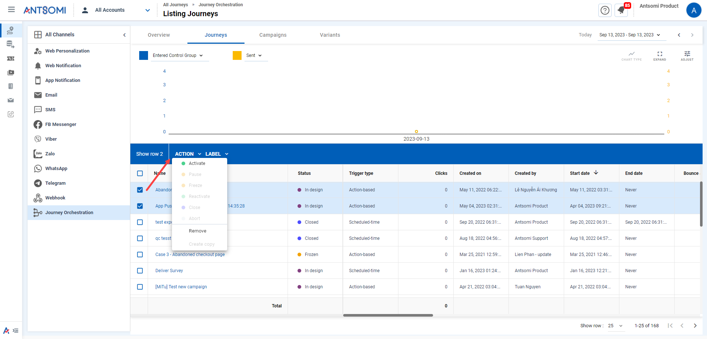<figcaption>
Interactions with ACTION
</figcaption></figure>

<table><thead><tr><th width="157">Status</th><th>Description</th></tr></thead><tbody><tr><td>Activate</td><td>It activates the designed journeys</td></tr><tr><td>Pause</td><td>It uses for pausing. After pausing, the journey will resume receiving new audiences. Audiences that have already entered the journey will be placed in the queue waiting for the next node</td></tr><tr><td>Freeze</td><td>It uses for freezing the journey. Once frozen, the journey will stop receiving new audiences. Audiences that have already entered the journey will be queued for the next node</td></tr><tr><td>Reactivated</td><td>It uses for reactivating the journey</td></tr><tr><td>Close</td><td>It uses for closing the journey. Once closed, the journey will stop receiving new audiences. Audiences that have entered the journey will be processed until the end of the flow</td></tr><tr><td>Abort</td><td>It uses for aborting the journey </td></tr></tbody></table>

The status of a journey could be changed in the journey settings.

<figure>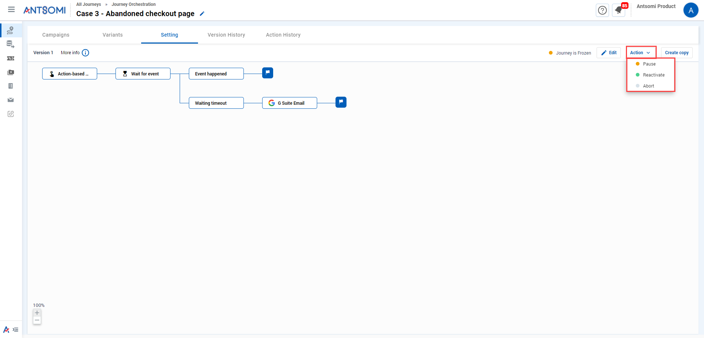<figcaption>
Interactions with ACTION in the journey settings
</figcaption></figure>

See more about the [Status of the Journey](../status-of-journey.md)

## Remove Journey

<figure>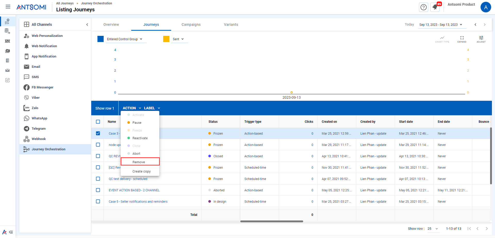<figcaption>
Remove
</figcaption></figure>


Note:  It does not allow to remove journeys activated and scheduled


## Create copy

Use 'Create copy' to make a copy of existing journeys.

<figure><figcaption>
Copy
</figcaption></figure>

## Label Journey

Label the journeys which helps group journeys with related characteristics. For example, label journeys by quarter, label journeys for VIP customer groups, etc.

<figure>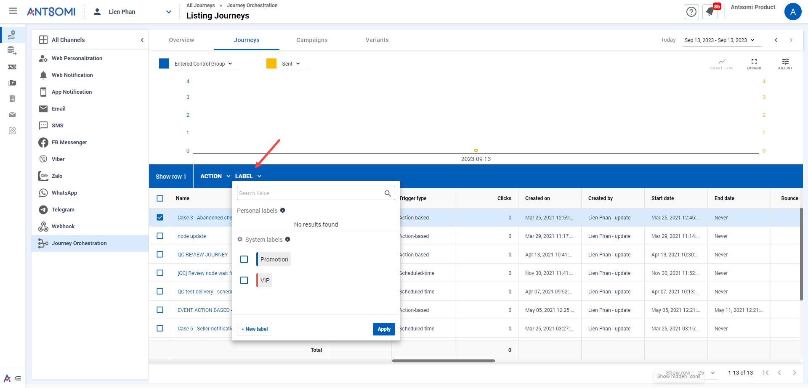<figcaption>
Label
</figcaption></figure>

[Click here](https://docs.antsomi.com/cdp-365-user-guide-en/marketing-hub/customer-journeys/label) to see more label utilities.

## Quick edit Journey name

Following these steps to edit the Journey name quickly:

1. Hover and click .png>) on the Journey name
2. Enter the name&#x20;
3. Click .png>)

## Stop allocating campaign

CDP 365 stops allocating the branch content of journey or the variant content by switching the status from .png>)to .png>).

<figure>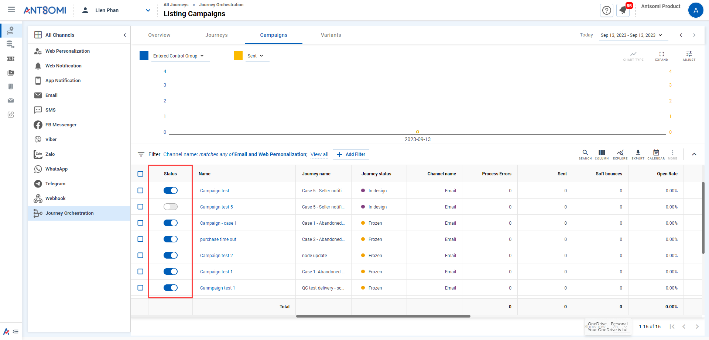<figcaption>
Stop allocating campaigns
</figcaption></figure>

Moreover, the journey can also stop allocating content in the Journey settings.

<figure>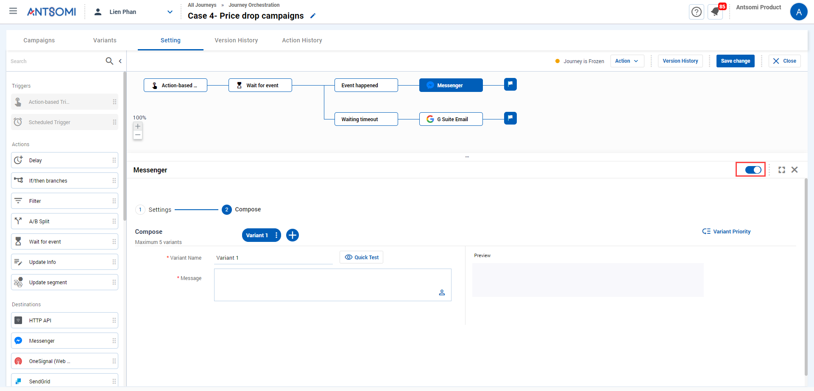<figcaption>
Stop allocating campaigns in the settings
</figcaption></figure>

## Version History

Versions of a journey could be viewed and restored in Version History

* Select a journey name
* Go to the settings of that journey&#x20;
* Click Edit&#x20;
* Click Version History&#x20;

<figure>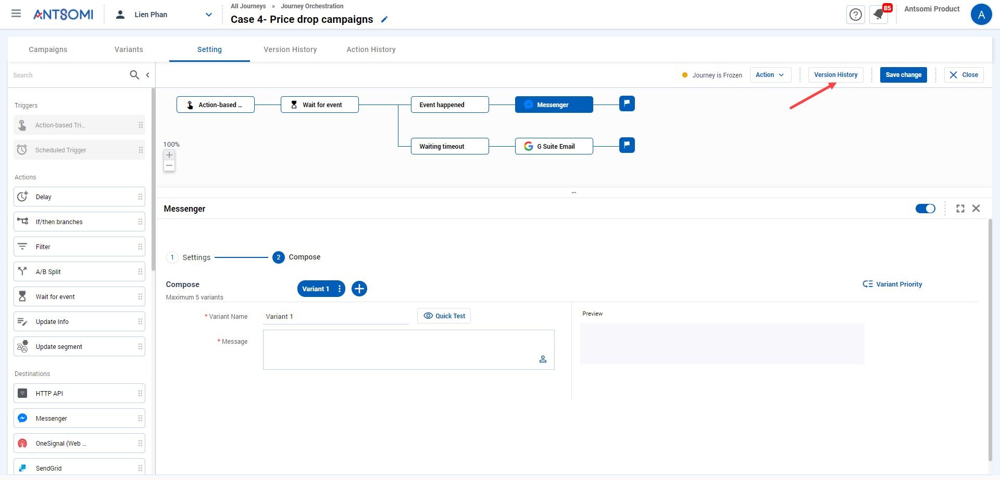<figcaption>
Version History
</figcaption></figure>

In Version History, could&#x20;

* View the edit history&#x20;
* Restore the version&#x20;

_After clicking SAVE CHANGE, a version history is recorded._

<figure>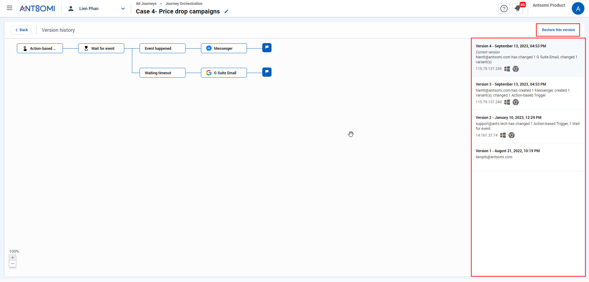<figcaption>
Version History
</figcaption></figure>

## Action History or Schedule History

These 2 tabs record the information about times that a Journey executed.&#x20;

The trigger type of a Journey will decide which of these 2 tabs it has.&#x20;

* If the journey is triggered by the action-based trigger, it would have Action History tab.
* If the journey is triggered by the schedule trigger, it would have Schedule History tab.

### Action History

Every time an audience enters a journey by performing an event,  a Process ID is created. Action History manages the data about these Process IDs.&#x20;

In the tab, it provides:

* Process ID&#x20;
* Process type is the trigger type of the journey&#x20;
* Visitor ID and Customer ID is the IDs of the audience who entered the journey&#x20;
* Resumed process ID is the ID of a process that was resumed&#x20;
* Journey version is the version which the audience entered
* State is the status of process ID, etc

State

* Waiting: waiting (eg: delay, waiting for event, ..)

- Completed: for Update Info node, Update Segment

* End: before the end node there is no Destination/ Update Segment/ Update Info

- Missing receiver: audience missed information for the delivery (phone/email)

* Violate destination frequency capping: blocked by destination FC

- Violate trigger frequency capping: blocked by trigger FC

* Sent content error: delivery sent error content

- Build content error: build content error

* Exit journey: stop before reaching the destination

- Delivered: 3rd response was sent successfully

* Bounce & Error: 3rd response bound & error

- Paused: variant/campaign of the destination node is off

<figure><figcaption>
Action History
</figcaption></figure>

### Schedule history

Every time an audience enters a journey during the time period set in the Trigger node,  a Process ID is created. Schedule history manages the data about these Process IDs.&#x20;

<figure>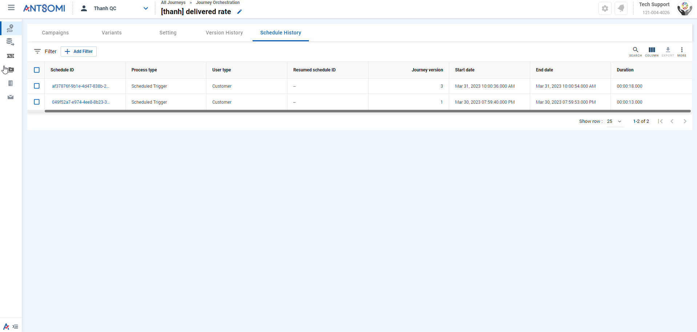<figcaption></figcaption></figure>

### Details of a process ID

If you a process ID, the screen direct you to the details of that process ID.&#x20;

The details are divided into two tabs

* Diagram shows the nodes which the audience has been and the status of each node
* Detail shows the details of each node&#x20;

<figure><figcaption>
Details of a process ID
</figcaption></figure>

The chart section in the detail tab helps users have a more intuitive view of the results of the processes.

<figure><figcaption></figcaption></figure>

There are 2 chart type: line chart and score card.

#### Line chart:

1. To show line chart, click on Chart type, select Line chart.

<figure><figcaption></figcaption></figure>

2. Select metric to show value in the chart. Metrics that can be chosen are the states of the process ID

<figure><figcaption></figcaption></figure>

3. Click on adjust to choose how to divide the points on the chart

<figure><figcaption></figcaption></figure>

#### Scorecard

1. To show scorecard, click chọn Chart type and select Scorecard.
2. Click on + Add Scorecard to choose metric show in chart. Metrics that can be chosen are the states of the process ID

<figure><figcaption></figcaption></figure>

### Resume

A process ID could be resumed following these steps&#x20;

* Go to Action/ Schedule History&#x20;
* Select the cell&#x20;
* Click EDIT
* Select a Resume type

<figure><figcaption>
Resume 
</figcaption></figure>

### Resume type

There are three types of resume for a process of a journey

1. Resume whole process: the process selected is resumed all nodes that the audience went through from the trigger node to the destination node. Not allow selecting a node to be resumed.
2. Resume from node: select a node to be resumed, and the journey is resumed. The resumed journey
   * Starts from the trigger node
   * Goes through the nodes required, which are before the selected node
   * Ends at a destination node.
3.  Resume specific node: select at least a node to be resumed, and the journey is resumed.&#x20;

    The resumed journey

    * Starts from the trigger node
    * Goes through the nodes required, which are before the selected node.
    * Ends at the selected node.

## Explore Customer Journey

The explore function gives you an overview of the data collected from the Journeys by visualizing with tables and charts.

<figure>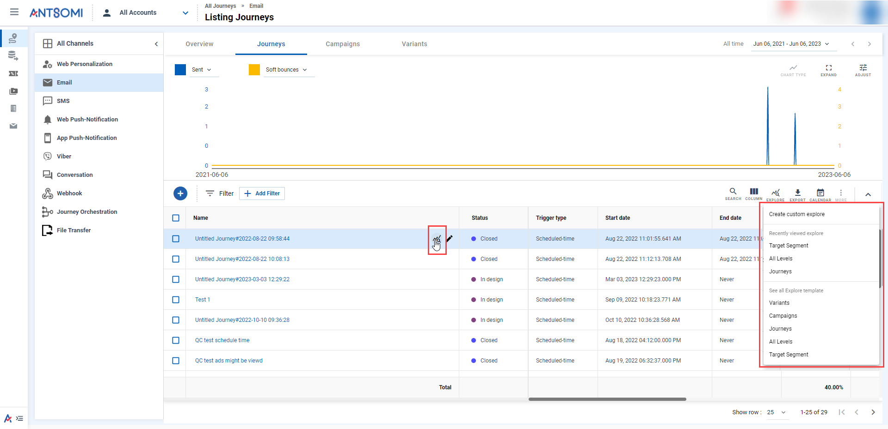<figcaption>
Explore Journey
</figcaption></figure>

You could create and customize visualizations yourself or using the system's built templates which provide neccessary fields of the object you want.

### How to use Explore function?

#### Explore ALL Journeys/ Campaigns/ Variants

1. Click on  button.
2. Select Create custom template to create template explore or Use a available template.
3. In Explore pop up, you can add charts or drag and drop to change the dimensions and metrics as desired.
4. Click on  to Save this explore become Private template (only you can view and edit) or Public template (everyone can view and use.)  Or select Manage template to view all template you can view.

#### Explore a SPECIFIC Journey/ Campaign/ Variant

1. Click on  button.
2. In Explore pop up, you can add charts or drag and drop to change the dimensions and metrics as desired.
3. Click on  to Save this explore become Private template (only you can view and edit) or Public template (everyone can view and use.)  Or select Manage template to view all template you can view.
4. In Explore pop up, you can add charts or drag and drop to change the dimensions and metrics as desired.

### EXPLORE TEMPLATE

There are 5 templates you could use:

1. Variants: Includes default fields and metrics collected from variants&#x20;

<figure>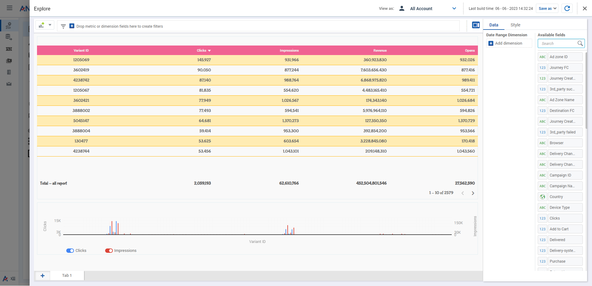<figcaption>
Variants
</figcaption></figure>

2. Campaigns: Includes default fields and metrics collected from campaigns

<figure><figcaption>
Campaigns
</figcaption></figure>

3. Journeys: Includes default fields and metrics collected from journeys

<figure><figcaption></figcaption></figure>

4. All Levels

<figure><figcaption></figcaption></figure>

5. Target Segment: By providing fields related to Segment, this template allows you to know which segments the Journeys are targeting.&#x20;

<figure>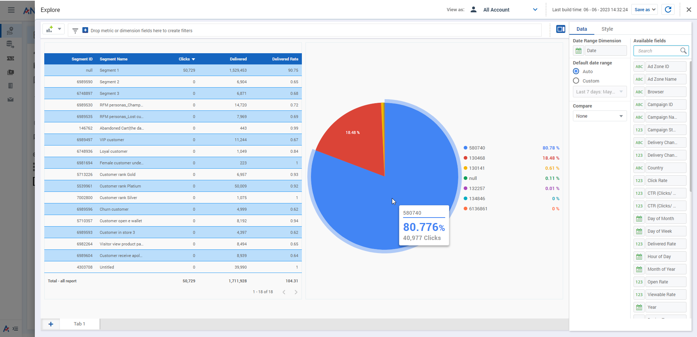<figcaption></figcaption></figure>
