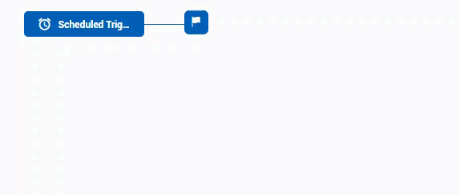
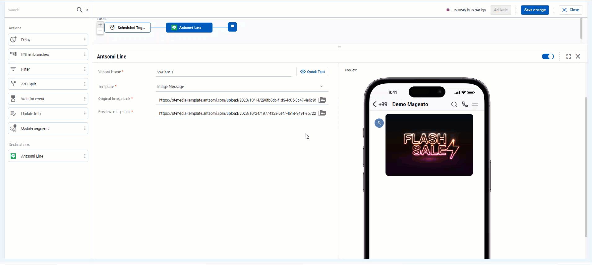
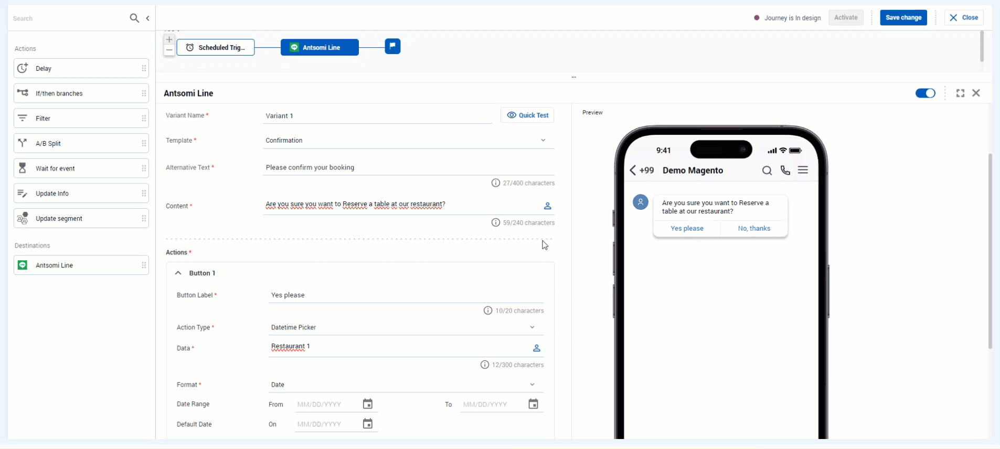
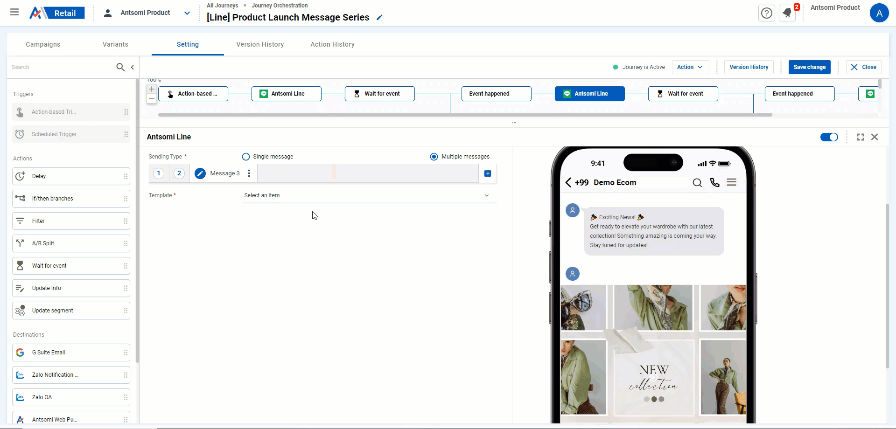
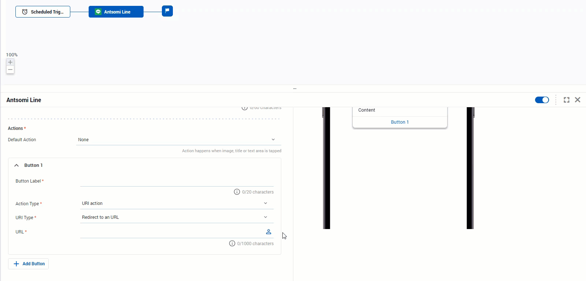

# Line App

## Step 1 - Add the Destination Node & choose Line App catalog

<figure><figcaption></figcaption></figure>

## Step 2 - Choose a template you want to use


Only the templates which has been chosen in any of the created destination were displayed here, so if you don't see the template you want, please check the destination.


<figure><figcaption></figcaption></figure>

## Step 3 - Configure the destination node

### &#x20;1. Choose a destination to send messages.&#x20;

<figure><figcaption></figcaption></figure>

### 2. Compose the message content

You need to fill out these fields to finish composing a message template:

* Variant Name <mark style="color:red;">\*</mark>: You should make a name as a summary of your content to easily track in the future
* Sending Type <mark style="color:red;">\*</mark>: To choose whether you want to send one message (Single message) or many messages (Multiple messages) to Line users at a time. If you choose Multiple option, there will be a message bar, allowing you to add a maximum of 5 message,

<figure><figcaption></figcaption></figure>

* Template <mark style="color:red;">\*</mark>: Depend on the template type you choose, the fields below will be displayed accordingly

#### **1️⃣   Text Message**

* Using this template, you could send out text message to your audience. It is useful in some scenarios such as sending welcome/ thank you message for following or purchasing a product/ service, etc.
* Type the content of your message in the Content <mark style="color:red;">\*</mark> field

<figure><figcaption></figcaption></figure>

#### **2️⃣   Image Message**

This template brings a great way to rapidly catch the attion of your audience by using vivid image. You could insert the image URL or click the button to choose the desired one.

* Original Image Link <mark style="color:red;">\*</mark> : The image the audience will see if clicking on the preview image
* Preview Image Link <mark style="color:red;">\*</mark> : The image appears in the chat box

<figure><figcaption></figcaption></figure>

#### **3️⃣ Sticker Message**

The targeted Line users will receive a sticker from your Line Official Account . You could only send one sticker at a time.

* Sticket Set <mark style="color:red;">\*</mark>: The name of the sticker package provided by LINE
* Sticker <mark style="color:red;">\*</mark>: The sticker in the chosen Sticker Set above

<figure><figcaption></figcaption></figure>

**4️⃣** Confirmation

This template is usually implemented to make a confirmation of a previous interaction. For instance, asking audience if they want to book an appointment or receive information of a sale campaign, etc.

It includes a descriptive text and two buttons. You can decide which action will happen when Line a user clicks on the elements (text, buttons).&#x20;

To setup a Confirmation template, you need to fill in these fields below:

<table><thead><tr><th width="199">Fields</th><th>Description</th></tr></thead><tbody><tr><td>Alternative text <mark style="color:red;">*</mark></td><td>It's the text which will appear in the device's notifications, chat list, and quote messages as an alternative to the template message.</td></tr><tr><td>Content <mark style="color:red;">*</mark></td><td>The text element of the template.</td></tr><tr><td>Action <mark style="color:red;">*</mark></td><td>Setup the action which will happen when Line users click on the two buttons. To read details about the list of action type, click <a href="line-app.md#action-type">here</a></td></tr></tbody></table>

<figure><figcaption></figcaption></figure>

#### **5️⃣ Buttons**

* This template allows you to send a message having the combination of text, image and buttons.

<figure><figcaption></figcaption></figure>

* Also, you can decide which action will happen when Line a user clicks on the elements (text, image, buttons) in the templates.
* To configure this template, you need to complete these fields

<table><thead><tr><th width="188">Fields</th><th>Description</th></tr></thead><tbody><tr><td>Alternative text <mark style="color:red;">*</mark></td><td>It's the text which will appear in the device's notifications, chat list, and quote messages as an alternative to the template message.</td></tr><tr><td>Image <mark style="color:red;">*</mark></td><td>The Image which will appear in the slide</td></tr><tr><td>Title <mark style="color:red;">*</mark></td><td>The title of the message template</td></tr><tr><td>Content <mark style="color:red;">*</mark></td><td>The content of the message template</td></tr><tr><td>Action <mark style="color:red;">*</mark></td><td>Setup the action which will happen when Line users click on an elements. There are two types of actions:  - Default Action: The action happenned when an image, title or content is click  - Button Action: The action happened when a button is clicked. To read details about the list of action type, click <a href="line-app.md#action-type">here</a></td></tr></tbody></table>

<figure><figcaption></figcaption></figure>

#### 6️⃣ **Carousel**

* This template allows you to send a carousel of maximum 10 slides. Each slide is a [Buttons ](line-app.md#5-buttons)template. This is especially helpful in promoting the diversity of your product, service or stores.
* Carousel template includes the same fields as the Buttons templates:
* Slides <mark style="color:red;">\*</mark>: The number of slide will be shown. You could add, duplicate & remove these slides by clicking the 3 dots buttons and choose the desired action.

<figure><figcaption></figcaption></figure>


* The number of buttons in all slide must be the same, if not, you could not save the journey.&#x20;
* The ratio of the image should be Rectangle (1.51:1) for the best quality.


After finishing, your message would look like this:

<figure><figcaption></figcaption></figure>

**7️⃣ Image Carousel**

This is also a type of message having a carousel of object and these objects are image and button only. It inlcudes these fields below:

<table><thead><tr><th width="200">Fields</th><th>Description</th></tr></thead><tbody><tr><td>Alternative text <mark style="color:red;">*</mark></td><td>It's the text which will appear in the device's notifications, chat list, and quote messages as an alternative to the template message.</td></tr><tr><td>Slide <mark style="color:red;">*</mark></td><td>The number of slide will be shown. You could add, duplicate &#x26; remove these slides by clicking the 3 dots buttons and choose the desired action.</td></tr><tr><td>Image <mark style="color:red;">*</mark></td><td>The Image which will appear in the slide. The image should be in Square ratio (1:1), if not, it would be zoomed out when delivering through Line</td></tr><tr><td>Button Label</td><td>The text of the button</td></tr><tr><td>Action Type <mark style="color:red;">*</mark></td><td>Setup the action which will happen when Line users click on the button. Depend on the chosen type, the configure fields will appear accordingly. To read details, click <a href="line-app.md#action-type">here</a></td></tr></tbody></table>

After finishing, your templates should look like this

<figure><figcaption></figcaption></figure>

8️⃣ **Standard Imagemap**

* This template allows you to send a square picture with an attached link. When Line users click on the picture, it will redirect them to a specific URL.&#x20;
* To create a standard imagemap message, you need to fill out these fields:

<table><thead><tr><th width="214">Fields</th><th>Description</th></tr></thead><tbody><tr><td><strong>Alternative Text</strong> <a data-footnote-ref href="#user-content-fn-1"><mark style="color:red;"><strong>*</strong></mark></a></td><td>It's the text which will appear in the device's notifications, chat list, and quote messages as an alternative to the template message.</td></tr><tr><td><strong>Image </strong><mark style="color:red;"><strong>*</strong></mark></td><td>The URL of the Image</td></tr><tr><td><strong>Action Type </strong><mark style="color:red;"><strong>*</strong></mark></td><td>Setup the action which will happen when Line users click on the button. Depend on the chosen type, the configure fields will appear accordingly. To read details, click <a href="line-app.md#action-type">here</a></td></tr></tbody></table>

After finishing, your templates should look like this

<figure><figcaption></figcaption></figure>

9️⃣ **Advanced Imagemap**

* This template allows you to send a picture with designated interactive areas. In each areas, you are able to determine what will happen if Line users click on it.
* To create an advanced imagemap, you will need to work with a editor popup:

<figure><figcaption></figcaption></figure>

It include these settings:

Area Layout - Determine the structure of the area on the designated picture. You could choose the popular layout or design your own&#x20;

<figure><figcaption>
Area Layout
</figcaption></figure>

Image - Choose how your picture will be added

Upload Type - Single: An image will be uploaded just like the background of the template

<figure><figcaption></figcaption></figure>

When clicking on an area of the image, the Action section appears and allows you to define the action type. Depending on the action you choose, the additional fields will be added automatically. There are several actions to be used, such as:

* No action
* [Message Action](line-app.md#id-1-message-action)
* [Redirect to an URL](line-app.md#id-2-uri-action)
* Play a video

<figure><figcaption></figcaption></figure>

Upload Type - Multiple: Each cell will contain an image

<figure><figcaption></figcaption></figure>

On each cell, you could also assign the action and make advanced action to design the picture

<figure><figcaption></figcaption></figure>

#### ACTION TYPE

When Line users interact with the message templates sent from CDP 365, the chosen action will happened. There are 4 types of action:

#### **1️⃣** Message Action

When an element associated with this action is tapped, a message would be sent from Line user to Line Bussiness Account with the content input in **Message Text&#x20;**<mark style="color:red;">**\***</mark>

<figure><figcaption></figcaption></figure>

#### **2️⃣** URI Action

There are 2 types of URI Action happened when an element associated with this action is tapped:

<figure><figcaption></figcaption></figure>

* Redirect to an URL: An URL will be opened in LINE's in-app browser&#x20;
* Call a telephone number: The call screen of audience's device will be opened with the phone number input in **Phone number&#x20;**<mark style="color:red;">**\***</mark> field

#### **3️⃣** Datetime Picker&#x20;

When an element associated with this action is tapped, a calendar will be open to allow Line users to choose datetime. After they submit the selection, an event will be fired to CDP 365 with the chosen option and a specified text.&#x20;

**Data&#x20;**<mark style="color:red;">**\***</mark> - The specified text included in the event fired after Line users has chosen datetime. This could be applied to analyze the data of the campaign.&#x20;

For example:&#x20;

* We (Antsomi) sent out a carousel templates with new features released this September to engage our customer. Each slide of feature will has the button Schedule a demo having been assigned with Datetime Picker action with the different keyword.&#x20;
* Therefore, everytime a user selects a time, an event will be fired to CDP 365. Based on the keyword, we could calculate how many people were interested in and actually made an appointment to know more about a feature in the slide.

<figure><figcaption></figcaption></figure>

**Format** <mark style="color:red;">\*</mark> - Choose the format of the calendar

* Date: Calendar only allows to choose date (DD/MM/YYYY)
* Time: Calendar only allows to choose time (HH:MM:SS)
* Datetime: Calendar allows to choose both date and time

Depending on the Format you choose, the Range and Default value field below will appear accordingly.

* Date/ Time Range: Choose the smallest and largest date or time value that Line users could select
* Default Date/ Time: Choose a specific date or time value to be preselected in the calendar

<figure><figcaption></figcaption></figure>

#### **4️⃣** Postback Action

When an element associated with this action is tapped, a postback event is returned with the content filled in CDP 365.&#x20;

<figure><figcaption></figcaption></figure>

❗<mark style="color:red;">**NOTE**</mark> ❗

* With every Landing Page URL you add to the template, if you want to record the number of clicks, you must shorten the link. To do so, please follow these step:
* Click on the human icon  --> Choose Add Shortlink option (optional, it only displays when it also allows Add Personalization) --> Insert the URL in the pop-up & click OK

<figure><figcaption></figcaption></figure>

* To manage the link you have shortened, go to app [Link Management](../../../link-management.md) in Marketing Hub

[^1]: 
