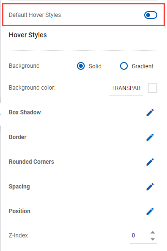

# Coupon Wheel

<figure><figcaption></figcaption></figure>

## Content

<figure><figcaption></figcaption></figure>

### Coupon Wheel Setting

<figure><figcaption></figcaption></figure>

#### Customize Wheel Sections

The settings have

* .png>) or : adding or deleting sections
* Label: naming sections
* Internal code: is the name managed by the system of CDP 365 which is automatically generated by Label
* Can Win and Win Chance (%): Managing the win probability of each section. Can Win must turn on if the section can be won.
* Pool and Coupon code: Managing the promotion pool is used by each section. Pool must turn on if the section uses a promotion pool to send out prizes.
* Limit Spinning: Managing the number of win times of each section. It includes
  * Out of code is available if Pool is on. The setting means audiences stop winning the section when the codes in the selected promotion run out.
  * Set value means audiences stop winning the section when reaching the number of winning times set. For example, if the set value is 1, then all audiences spinning the wheel can win the section only one time. If selecting Set value, then set
    * Capping level: has Journey, Campaign, and Variant.&#x20;
    * Frequency: includes This Hour, This Day, This Week, This Month, and Lifetime. Lifetime means the whole time that a journey is active.
    * The requirement of the campaign is the section can win 2 times in the journey. Then Limit Spinning selects Set value - 2, Capping Level selects Journey, and Frequency selects Lifetime.
  * Unlimited means audiences can win the section unlimitedly.

For example, the wheel sends out 2 TVs, 10 backpacks, 20 glasses of water, 1,000 20% off codes, and an unlimited number of 10K discount codes. Set Win chance is 10%, 15%, 25%, 20%, and 30% respectively. Limit Spinning is 2, 10, 20, 1,000, and Unlimited respectively.

_**Notes**: Limit Spinning is different from Can Win and Win Chance. Can Win allows the audience would win the section at the probability of winning set in Win Chance. Limit Spinning allows setting the actual number of times that audiences would win the section._

<figure><figcaption></figcaption></figure>

#### Section colors

You can set the color of each section

#### Wheel color

You can adjust the Outer Wheel Color, Inner Wheel Color, and Flipper Color

### Coupon Setting

<figure><figcaption></figcaption></figure>

#### Error Message

Enter the text of the Error Message

#### Position

The position displays the Error Message

## Advanced

<figure><figcaption></figcaption></figure>

### Coupon Wheel Styling

<figure><figcaption></figcaption></figure>

#### Font Settings

You can change the Font family, Font color, Font size, Font weight, Line height, Letter spacing, etc.

#### Wheel Width

You can set the width of the Wheel

#### Pull Direction

You can change the position of the Wheel

### Container Styling

<figure><figcaption></figcaption></figure>

1. _**Solid**_: Applies a single color uniformly within the whole of an object by selecting the _**Background color**_
2. _**Gradient:**_ It applies a continuous blend of two or more colors, where one color gradually fades and changes into another. You can choose the _**Gradient Style**_:&#x20;
   * _**Linear**_: Change the angle of the gradient
   * _**Radial**_: Change the positioning (right center, left top, left center, etc)
   * _**First color & first color location**_
   * _**Second color & second color location**_

#### **Box Shadow**

It allows you to add shadow effects around an element's frame by selecting a shadow style (None, Light, Custom)

#### **Border**

It allows you to specify the style, width, and color of an element's border

#### **Rounded Corners**

It allows you to define the radius of an element's corners

#### **Spacing**

* _**Inner Spacing (Padding):**_ \
  Padding is inside the border (or edge) of your element. Increasing the padding will “push” your content into the middle of your box, away from your borders. If you remove the padding, your content will take up the entire box
* _**Outer Spacing (Margin):**_ \
  Margin is on the outside of the border of your element. If you increase the margin, it will increase the space between this element and the ones next to it. If you remove your margin, there will be no extra space between your elements

#### Position

It allows you to adjust the position of elements in the block

#### Z-Index

* The z-index property specifies the stack order of an element
* An element with greater stack order is always in front of an element with a lower stack order

#### Custom ID attribute

The ID of a block, which is used in _**Custom CSS, Custom Javascript**_

#### Custom Class attribute

The class of a block, which is used in _**Custom CSS, Custom Javascript**_

#### Hover Styles

You can configure the _**Hover Styles**_ by turning off the status of _**Default Hover Styles**_

<figure><figcaption></figcaption></figure>

**a. Background**

1. _**Solid**_: Applies a single color uniformly within the whole of an object by selecting the _**Background color**_
2. _**Gradient:**_ It applies a continuous blend of two or more colors, where one color gradually fades and changes into another. You can choose the _**Gradient Style**_:&#x20;
   * _**Linear**_: Change the angle of the gradient
   * _**Radial**_: Change the positioning (right center, left top, left center, etc)
   * _**First color & first color location**_
   * _**Second color & second color location**_

#### **b. Box Shadow**

It allows you to add shadow effects around an element's frame by selecting a shadow style (_**None, Light, Custom**_)

#### **c. Border**

It allows you to specify the style, width, and color of an element's border

#### **d. Rounded Corners**

It allows you to define the radius of an element's corners

#### **e. Spacing**

* _**Inner Spacing (Padding)**_: \
  Padding is inside the border (or edge) of your element. Increasing the padding will “push” your content into the middle of your box, away from your borders. If you remove the padding, your content will take up the entire box
* _**Outer Spacing (Margin)**_: \
  Margin is on the outside of the border of your element. If you increase the margin, it will increase the space between this element and the ones next to it. If you remove your margin, there will be no extra space between your elements

#### f. Position

It allows you to adjust the position of the hover

#### g. Z-Index

* The z-index property specifies the stack order of an element
* An element with greater stack order is always in front of an element with a lower stack order

### Display Condition

You can set the condition to display the button

<figure><figcaption></figcaption></figure>

* _**Condition**_: It includes _**None, Show when, Hidden when**_
* _**Field**_: It contains _**Business Object attributes**_
* _**Index**_: The number of the row in the _**Business Objects Data table**_
* _**Operator**_: It includes _**contains, does not contain, starts with, doesn't start with, ends with, doesn't end with**_, etc.
* _**Value**_: you can input the value or select an _**attribute from Business Object or Event**_


-   The Business Object attributes in Field are selected Business Object in Template Setting

    <figure><figcaption></figcaption></figure>
- If Business Object in Template Setting does not be selected, a popup of _**Select Source**_ will appear

.png>)

