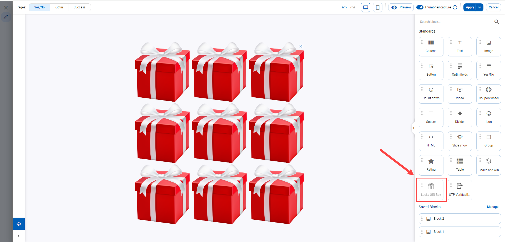

# Lucky gift box

After inserting a block in Live Preview, you can configure the settings:

<figure><figcaption></figcaption></figure>

## Content

There are 3 section in Content tab:

1. [Gift box](lucky-gift-box.md#gift-box): General setting for block
2. [Cells](lucky-gift-box.md#cells): Configure individually for each gift box
3. [Coupon setting](lucky-gift-box.md#coupon-setting): Setting for coupon code

<figure><figcaption></figcaption></figure>

### 1. Gift box

<figure><figcaption></figcaption></figure>

#### Customize Rewards

Click on Customize Reward button will show Customize Gift Box

<figure><figcaption></figcaption></figure>

The settings have

*  or .png>): adding or deleting reward.
* Rewards: naming Rewards.
* Internal code: is the name managed by the system of CDP 365 which is automatically generated by Rewards
* Win Chance (%): Managing the win probability of each reward.
* Pool and Coupon code: Managing the promotion pool is used by each reward. Pool must turn on if the reward uses a promotion pool to send out prizes.
* Limit Random: Managing the number of win times of each reward. It includes:
  * Out of code is available if Pool is on. The setting means audiences stop winning the section when the codes in the selected promotion run out.
  * Set value means audiences stop winning the reward when reaching the number of winning times set. For example, if the set value is 1, then all audiences click on the gift box can win the reward only one time. If selecting Set value, then set
    * Capping level: has Journey, Campaign, and Variant.&#x20;
    * Frequency: includes This Hour, This Day, This Week, This Month, and Lifetime. Lifetime means the whole time that a journey is active.
    * The requirement of the campaign is the section can win 2 times in the journey. Then Limit Spinning selects Set value - 2, Capping Level selects Journey, and Frequency selects Lifetime.
  * Unlimited means audiences can win the reward unlimitedly.

#### Number of rows & Number of columns

Set the number of gift boxes

#### Width

You can set width of block

#### Align

You can set align of block. There are 3 option: Left, Center, Right.

### Cells

<figure><figcaption></figcaption></figure>

#### Cell Image

Click on Cell Image Button will display Cell Image pop up:

<figure><figcaption></figcaption></figure>

Need to upload image before clicking on gift box. You can use 1 image for all gift boxes or 1 image for each gift box by turning on or off the Apply image all feature.

#### Cell Gap

Adjust the distance between gift boxes

#### Align

Align the position of the gift boxes relative to the entire block.

#### Animation when hover

Effect when hovering over the gift box. There are 2 options: Highlight the gift box or shake the gift box

#### Animation when click

Effect when clicking on the gift box. There are 3 options:

* Shake the gift box
* Replace the clicked gift box image with another gift box. Use the image uploaded in the Cell Image - Image after open section.
* Replace the entire block with another image. The user will upload the image they want to replace

#### Translation time

Waiting time to switch from optin view to success view after clicking on the gift box.

### Coupon Setting

Similar to the Coupon Setting section of the Coupon Wheel block

## Advanced

There are 3 section in Content tab:

1. Gift box Styling: Adjust colors,... for the entire block
2. Cells Styling: Adjust color,... for 1 gift box
3. Container Styling: Similar to other blocks

<figure><figcaption></figcaption></figure>

### Gift box Styling

<figure><figcaption></figcaption></figure>

#### Style

Choose the background color style for the block

#### Background Image

Upload background image for block

#### Box Shadow

Design shading for blocks

#### Border

Set border color for block

#### Rounded Corners

Set rounded corners for the block

#### Spacing

Adjust the distances between the block and each gift box and between the block and the column containing the block
