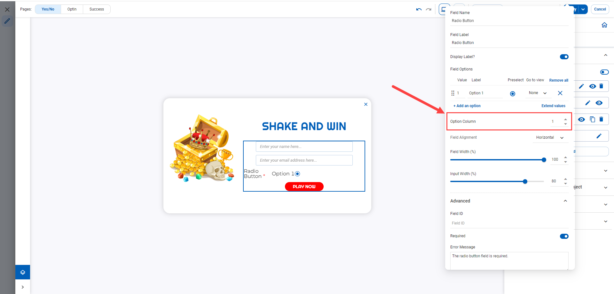

# Radio button/ Checkbox

The unique settings of _Radio button/ Checkbox_ field include:

## _<mark style="color:blue;">**Radio button**</mark>_

<figure><figcaption></figcaption></figure>

<figure><figcaption></figcaption></figure>

⬛ **Field Options:** It is similar to Dropdown field.

⬛ **Option Column**: Choose the number of column that the options will be filled.

<figure><figcaption></figcaption></figure>

## _<mark style="color:blue;">**Checkbox**</mark>_&#x20;

⬛ **Field Options** - It is similar to Radio button

⬛ **Option Column** - It is similar to Radio button
