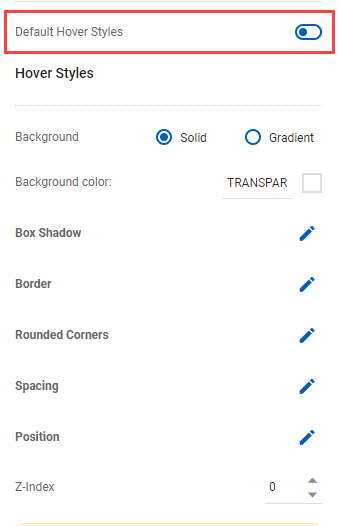
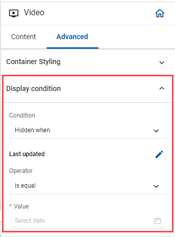

# Video

<figure><figcaption></figcaption></figure>

## Content&#x20;

<figure><figcaption></figcaption></figure>

## Video

#### Hosted Video URL

* _**Static:**_ Enter the Video URL
* _**Dynamic:**_ Select source and select field and index


-   The Business Object attributes in Field are selected Business Object in Template Setting

    
- If Business Object in Template Setting does not be selected, a popup of _**Select Source**_ will appear



#### Aspect Ratio

The aspect ratio of an element describes the proportional relationship between its width and its height

#### Width

It allows you to change the width of the video in %

#### Align

You can set the alignment of a video (left, right, center)

## Advanced

<figure><figcaption></figcaption></figure>

### Container Styling

<figure><figcaption></figcaption></figure>

#### **Style**

1. _**Solid**_: Applies a single color uniformly within the whole of an object by selecting the _**Background color**_
2. _**Gradient:**_ It applies a continuous blend of two or more colors, where one color gradually fades and changes into another. You can choose the _**Gradient Style**_:&#x20;
   * _**Linear**_: Change the angle of the gradient
   * _**Radial**_: Change the positioning (right center, left top, left center, etc)
   * _**First color & first color location**_
   * _**Second color & second color location**_

#### **Box Shadow**

It allows you to add shadow effects around an element's frame by selecting a shadow style (None, Light, Custom)

#### **Border**

It allows you to specify the style, width, and color of an element's border

#### **Rounded Corners**

It allows you to define the radius of an element's corners

#### **Spacing**

* _**Inner Spacing (Padding):**_ \
  Padding is inside the border (or edge) of your element. Increasing the padding will “push” your content into the middle of your box, away from your borders. If you remove the padding, your content will take up the entire box
* _**Outer Spacing (Margin):**_ \
  Margin is on the outside of the border of your element. If you increase the margin, it will increase the space between this element and the ones next to it. If you remove your margin, there will be no extra space between your elements

#### Position

It allows you to adjust the position of elements in the block

#### Z-Index

* The z-index property specifies the stack order of an element
* An element with greater stack order is always in front of an element with a lower stack order

#### Custom ID attribute

The ID of a block, which is used in _**Custom CSS, Custom Javascript**_

#### Custom Class attribute

The class of a block, which is used in _**Custom CSS, Custom Javascript**_

#### Hover Styles

You can configure the _**Hover Styles**_ by turning off the status of _**Default Hover Styles**_

<figure><figcaption></figcaption></figure>

**a. Background color**

1. _**Solid**_: Applies a single color uniformly within the whole of an object by selecting the _**Background color**_
2. _**Gradient:**_ It applies a continuous blend of two or more colors, where one color gradually fades and changes into another. You can choose the _**Gradient Style**_:&#x20;
   * _**Linear**_: Change the angle of the gradient
   * _**Radial**_: Change the positioning (right center, left top, left center, etc)
   * _**First color & first color location**_
   * _**Second color & second color location**_

#### **b. Box Shadow**

It allows you to add shadow effects around an element's frame by selecting a shadow style (_**None, Light, Custom**_)

#### **c. Border**

It allows you to specify the style, width, and color of an element's border

#### **d. Rounded Corners**

It allows you to define the radius of an element's corners

#### **e. Spacing**

* _**Inner Spacing (Padding)**_: \
  Padding is inside the border (or edge) of your element. Increasing the padding will “push” your content into the middle of your box, away from your borders. If you remove the padding, your content will take up the entire box
* _**Outer Spacing (Margin)**_: \
  Margin is on the outside of the border of your element. If you increase the margin, it will increase the space between this element and the ones next to it. If you remove your margin, there will be no extra space between your elements

#### f. Position

It allows you to adjust the position of elements ịn block

#### h. Z-Index

* The z-index property specifies the stack order of an element
* An element with greater stack order is always in front of an element with a lower stack order

### Display condition

You can set the condition to display the block

<figure><figcaption></figcaption></figure>

* _**Condition**_: It includes _**None, Show when, Hidden when**_
* _**Field**_: It contains _**Business Object attributes**_
* _**Index**_: The number of the row in the _**Business Objects Data table**_
* _**Operator**_: It includes _**contains, does not contain, starts with, doesn't start with, ends with, doesn't end with**_, etc.
* _**Value**_: you can input the value or select an _**attribute from Business Object or Event**_


-   The Business Object attributes in Field are selected Business Object in Template Setting

    <figure><figcaption></figcaption></figure>
- If Business Object in Template Setting does not be selected, a popup of _**Select Source**_ will appear

.png>)

