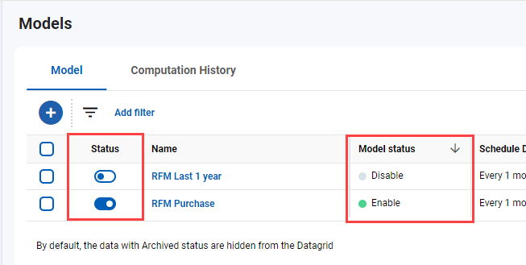
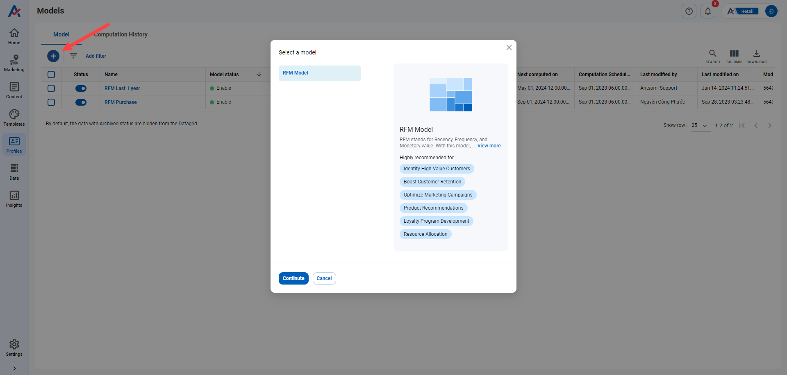

# Predictive Models

## Step 1: Find the Predictive Models

Navigate to **Profiles**, it is **Models**.

<figure><figcaption></figcaption></figure>

## Step 2: Where should you navigate

There are a pair of tabs:

1. [**Models**](./#understand-the-predictive-models-tab): This tab oversees all the models you have created.
2. **Computation Histories**: This tab governs the histories of computations for the models.

<figure><figcaption></figcaption></figure>

### Understand the Predictive Models tab

1.  **Status**\
    A model can exist in one of three statuses:

    1. **Enabled**: It can compute according to the designated schedule.
    2. **Disabled**: The computation schedule is turned off, but its data remains accessible.
    3. **Archived**: The model is no longer usable.

    <figure><figcaption></figcaption></figure>
2.  **Schedule details**: tell the model's schedule.

    <figure><figcaption>
Schedule Details
</figcaption></figure>

## Step 3: Create a model

To create a new model, please press the .png>) icon.

Then select a list of proposed models.

<figure><figcaption></figcaption></figure>

