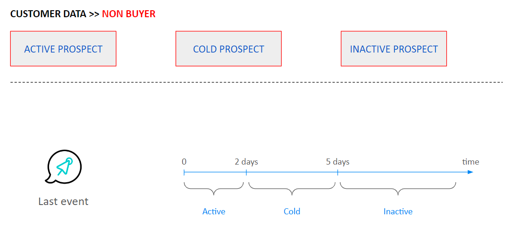

# Lifecycle Stages

## **INTRODUCTION**

'Lifecycle stages' predictive model targets customers by analyzing event data and purchasing behavior. Through this model, customers are classified into smaller groups, providing significant benefits for segmentation and planning marketing strategies.&#x20;

Customers are divided into two main groups: **Non-buyers** (people who have not yet made a purchase) and **Buyers** (people who have made a purchase).

<figure><figcaption></figcaption></figure>

In regards to the **Non-buyer group**, the 'Lifecycle stage' model will analyze the level of interaction based on event data such as page views, product views, logins, etc., before allocating the customer to three smaller groups: active prospects, cold prospects, and inactive prospects.

* **Active prospect**: customers with a high level of interaction
* **Cold prospect**: customers with a medium level of interaction
* **Inactive prospect**: customers with a low level of interaction

<figure><figcaption></figcaption></figure>

***

In terms of **Buyer group**, the predictive model will group these customers into four segments: lapsed buyer, first time buyer, instant first time buyer, repeat buyer, regained buyer according to three metrics that includes **recency**, **transaction order** and **retention**.

Recency

Definition: Recency refers to the duration between the last purchase and the time of calculation by the model. This metric is utilized by the model to recognize the 'lapsed buyer' group.

**Lapsed buyer**: Individuals who have refrained from making a purchase for an extended period.

Transaction order

Definition: Transaction order represents the count of a customer's orders.

**First time buyer**: customers who make a purchase for the first time.

**Instant first time buyer**: customers  who make a purchase for the first time and agree to provide personal information such as phone number and email.

Retention

Definition: Retention refers to the duration between a customer's last two orders.

**Repeat buyer**: customers for whom the duration between their last two orders is short.

**Regained buyer**:  customers for whom the duration between their last two orders is long.

## CREATE A NEW LIFECYCLE STAGES MODEL

### 1. Select Lifecycle stages model

In Predictive model menu, click .png>)

Afterward, select **Lifecycle Stages** and click **Continue** to generate a new model

<figure><figcaption></figcaption></figure>

### 2. Prepare data for model's computation

**Lifecycle stages** model will utilize data according to the configurations set in Step 1 to compute results.

* **Data transaction**: select a data object where stores information related to transaction history
* **Where**: this feature allows users to modify the selected data object in the Data transaction by filtering according to its attributes.
* **Customer identity**: choose an attribute used to uniquely identify customers. The model will employ this attribute to calculate the number of customers.
* **Transaction date**: select an attribute that stores the time when a customer makes a purchase.
* **Revenue**: select an attribute that contains transaction values.
* **Time range**: define the duration for which the model will gather data for its calculations. We provide two options: all-time and custom.
* **Engagement event**: select events that you use to evaluate the customer engagement level. We also allow you to configure a duration for event data.
* **Customer register**: select an attribute that determines the time when your system creates a new customer based on the personal information provided by a customer.

<figure><figcaption></figcaption></figure>

Following, click **Next** to proceed to step 2.

### 3. View result

The **Lifecycle stages** model will automatically compute and display the final result in Step 2. Additionally, we also provide an expert mode that allows experts to modify the model in more detail.

<figure><figcaption></figcaption></figure>

### 4. Apply to build segments

Select groups that you need to create segments. After that, you can use these segments for marketing campaigns.

<figure><figcaption></figcaption></figure>

### 5. Record customer data via Audience movement event

When this event is activated, the model will record customers who transition from one group to another. Data is leveraged for segmentation purposes.

<figure><figcaption></figcaption></figure>
