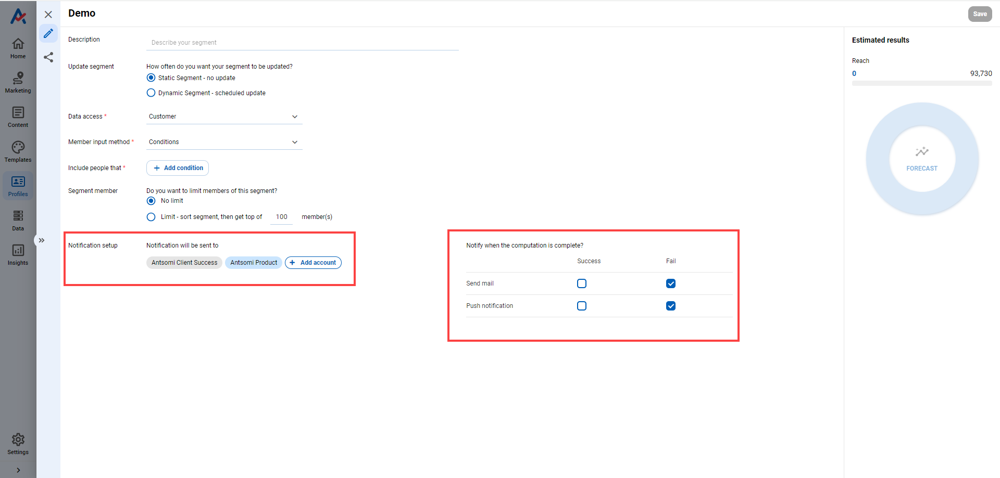
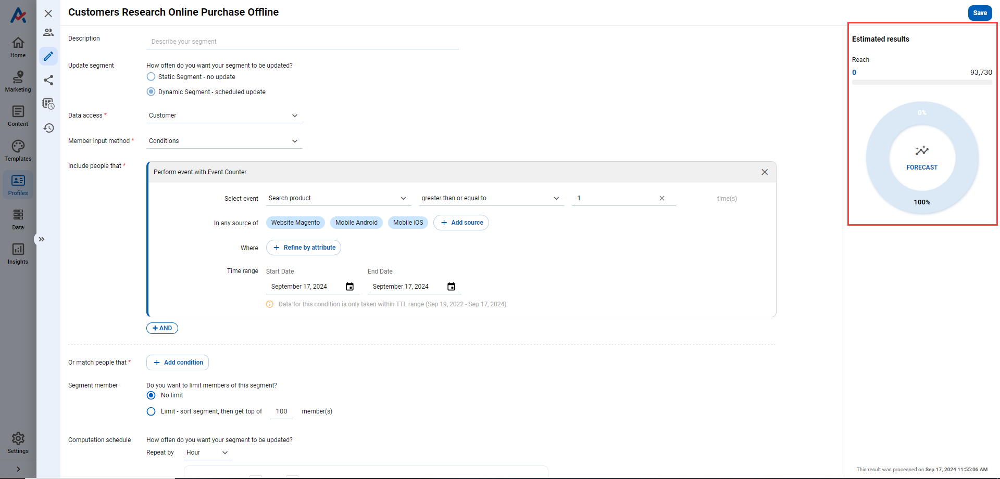
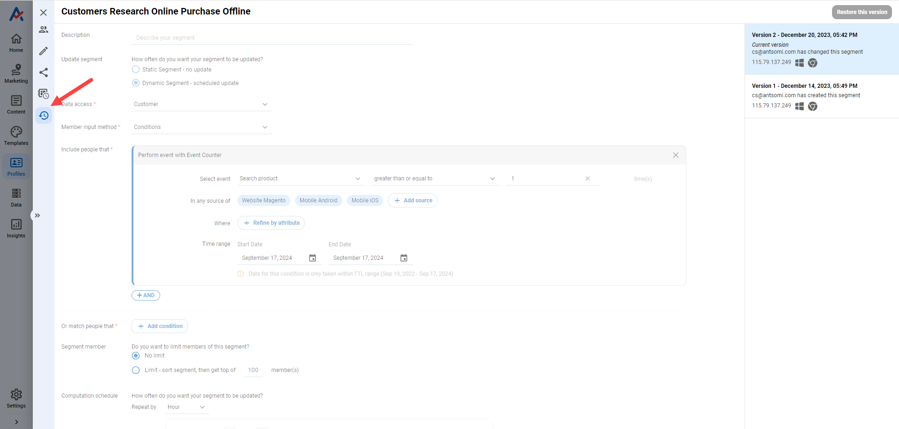

# Segments

## Overview

Segments app manages segments of audiences created by the data available in **CDP 365** or combined with external data.&#x20;

It includes 2 tabs which are **Segments** and **Computation Histories**.

<figure><figcaption></figcaption></figure>

## Segments tab

The tab provides segment creation and management.

### Create a Segment

Following these steps to create a **Segment**:

1. Click &#x20;
2. Select a type of segment&#x20;
3. Set the configure of segment
4. Click **Save**
5. After clicking Save, a pop-up will appear confirming whether to build the segment right away.
   * If it is agreed upon, the segment will be built immediately.&#x20;
   * Otherwise, the segment will build according to the setting.

<figure><figcaption></figcaption></figure>

<figure><figcaption></figcaption></figure>

#### Segment types

<figure><figcaption></figcaption></figure>

There are 2 groups of segments based on the types of audiences:&#x20;

<table><thead><tr><th width="160.33333333333331">Audience type</th><th width="221">Segment type</th><th>Description </th></tr></thead><tbody><tr><td>Customers</td><td>Customer Segment</td><td>Create a segment based on the data available in the <strong>Customer</strong> business object</td></tr><tr><td></td><td>Customers and Segment</td><td>
Include 2 steps: 
<ul><li>Upload data to the Customer business object </li><li>Create the segment  </li></ul></td></tr><tr><td>Visitors</td><td>Visitor Segment</td><td>Create a segment based on the data available in the <strong>Visitor</strong> business object </td></tr><tr><td></td><td>Visitors and Segment</td><td>
Include 2 steps: 
<ul><li>Upload data to the Visitor business object </li><li>Create the segment  </li></ul></td></tr></tbody></table>

#### The configuration of a segment

_**General information**_&#x20;

Audience name: the name of the segment&#x20;

Description: describe the segment

_**Update segment**_

<figure><figcaption></figcaption></figure>

Does the segment update?

<table><thead><tr><th width="179">Update Segment</th><th>Description</th></tr></thead><tbody><tr><td>Static </td><td>The segment is built only once corresponding to the setting.</td></tr><tr><td>Dynamic </td><td>The segment is built and updated by a schedule corresponding to the setting.</td></tr></tbody></table>

> Create a customer segment of those who shopped 3 times per week, for example, the result was 2,000 customers after creating.&#x20;
>
> * Static segment, the segment was built only once and the result was 2,000 customers.
> * Dynamic segment, the segment was updated and the result changed over the computation schedules.

#### _**Member input method**_ 

<figure><figcaption></figcaption></figure>

What are the characteristics of the audience in a segment?

<table><thead><tr><th width="221">Member input method</th><th>Description</th></tr></thead><tbody><tr><td><strong>Conditions</strong></td><td>
Based on the data available in CDP 365
<ul><li>Perform event: filter audiences based on the interactions/events of customers or visitors. For example, build a segment for customers who have more than 3 successful orders this month. </li><li>Have attribute: filter audiences based on the attributes of the customer or visitor business objects. For example, build a segment for visitors who locate in Ho Chi Minh city.</li></ul></td></tr><tr><td><strong>Matching file</strong></td><td>Filter audiences based on the combination of CDP 365's data and uploaded data. </td></tr><tr><td><strong>Empty segment</strong></td><td>Create an empty-value segment to be updated from marketing campaign scenarios in Customer Journeys.</td></tr><tr><td><strong>Unsubscribe segment</strong></td><td>Audiences are the people who unsubscribe from emails.</td></tr></tbody></table>

#### _**Segment Member**_

<figure><figcaption></figcaption></figure>

Limit the number of audiences in a segment.

<table><thead><tr><th width="191">Segment member</th><th>Description</th></tr></thead><tbody><tr><td>No Limit</td><td>An unlimited number of members in the segment.</td></tr><tr><td>Limit</td><td>
Limit the number of member in the segment, by:
<ul><li>Get top of: the number of member</li><li>Sort by: attribute of the customer or visitor business object</li><li>Sort order: ascending/descending</li></ul></td></tr></tbody></table>

_**Notification Setup**_

<figure><figcaption></figcaption></figure>

* **Account**: set up account(s) receiving notification
* **Notify options**: the notification can be sent by email or pushed notification when the computation complete success or fail

#### _**Forecast**_&#x20;

The feature gives a statistical report of the to-be-built segment which includes

* The number of members the segment could have
* The percentage of the members in the segment compared to the total number of customers or visitors in the CDP 365.&#x20;

<figure><figcaption></figcaption></figure>

#### _**Version History**_&#x20;

The feature allows not only viewing details of edit history but also restoring a specific version.&#x20;

Each version is recorded after a time of saving.

<figure><figcaption></figcaption></figure>

### Check segments

After creating a segment, check at data table of Segments tab.&#x20;

<figure><figcaption></figcaption></figure>

#### Action with segment

Select at least one segment, click ACTION to adjust the status of a segment

<figure><figcaption></figcaption></figure>

<table><thead><tr><th width="147">Action</th><th>Description</th></tr></thead><tbody><tr><td>Enable</td><td><ul><li>When enabled, the segment status change to ENABLE</li><li>Enable means the segment is enabled to update its data</li><li>After a set time not being used, the segment automatically changes to disable.</li></ul></td></tr><tr><td>Disable</td><td><ul><li>When disabled, the segment status change to DISABLE</li><li>Disable means the segment is disabled to update its data</li><li>After a set time not being used, the segment automatically changes to archive.</li></ul></td></tr><tr><td>Archive</td><td><ul><li>When archived, the segment status change to ARCHIVE </li><li>The segment is unavailable to search or use in other apps. Using filter by the archive status to find it</li><li>After a set time not being used, the segment is automatically deleted. </li></ul></td></tr><tr><td>Recover</td><td><ul><li>Restore archived segments</li><li>During recovery, can't interact with the segment. </li></ul></td></tr><tr><td>Make a copy</td><td><ul><li>If demanding creates a segment with similar condition settings to an existing segment, use <strong>Make a copy</strong></li><li>Make a copy of the segment by following steps</li></ul><ol><li>Select an original segment </li><li>Select Make a copy in Action </li><li><strong>Name and confirm</strong> creating a copy </li><li>Adjust conditions </li><li>Save</li></ol></td></tr></tbody></table>


Note: The copy is only saved and calculated when you complete the step of clicking SAVE


#### Label

Label helps management of segments more productive.

<figure><figcaption></figcaption></figure>

#### Status of a Segment

Segment status can be changed by switching the toggle of Status.&#x20;

It indicates the status of a segment.

* .png>) means the segment status is 'Disable'. Turn on to force the segment to be built immediately.
* .png>) means the segment status is 'Enable'. Turn off to disable the computation ability of a segment.&#x20;

#### Name

By hovering over the name of a segment could have functions of&#x20;

* Go to the detailed settings of a segment, click .png>)
* Explore the member of a segment, click .png>)
* Rename the segment, click .png>)

<figure><figcaption>
Segment name
</figcaption></figure>

#### Update method

It indicates the type of update method that the segment is applied.&#x20;

#### Segment status and Last computation status

The computation of a segment includes 3 steps

* Step 1: check the resources in CDP 365 to compute the segment
* Step 2: compute members of the segment&#x20;
* Step 3: store the data of the segment in CDP 365

<table><thead><tr><th width="237">Last computation status</th><th>Description</th></tr></thead><tbody><tr><td>Waiting Initial</td><td>The segment is waiting for the computation schedule</td></tr><tr><td>Waiting</td><td>The segment is in step 1</td></tr><tr><td>Computing</td><td>The segment is in step 2</td></tr><tr><td>Ready to use</td><td>The segment is done computing but in the progress of step 3</td></tr><tr><td>Success</td><td>The status is done step 3</td></tr><tr><td>Unsuccess</td><td>The segment has been built unsuccessfully</td></tr></tbody></table>


There is a relationship between Segment status and Last computation status.

* If the segment status is 'enable', the last computation status could be updated based on the computation schedule or forced to update.
* Otherwise, its last computation status is updated once after the first build.


#### Source

It indicates the type of member input method used to build the segment, including

* Matching file means the segment is built by the matching file method&#x20;
* Customer/Visitor attribute means the segment is built by the condition method using Have attribute condition&#x20;
* Sources mean the segment is built by the condition method using Perform event condition.

#### Members

It shows the number of members included in a segment.&#x20;


Attributes shown in Segment tab could be modified in Column.&#x20;


## Computation Histories tab

**Computation Histories** provides information about the history of each computation by computation ID.&#x20;

* Segment name and segment version give details of which version of a segment was computed. By clicking the version, it could direct to the version history of that version.
* Time-related of information includes the time of start and end and the duration
* Computation trigger means who triggered the computation, including user (force to compute) or system (following the computation schedule)&#x20;
* Error info gives a reason for the unsuccess status

<figure><figcaption></figcaption></figure>

### Details of Member input method&#x20;

Explain more details of two methods: Condition and Matching file

#### Condition&#x20;

There are two options for the condition method that requires different settings

* _**Perform event**_

1. **Select event** is the interaction of visitors or customers. **Select event** includes 3 steps: select an event, select comparing method, and input value of comparison&#x20;
2. **In any source of** is the domain where the event happened. After selecting an event, **CDP 365** will propose a list of sources that have the event
3. **Where** is a filter of the selected event. **Where** could combine more than one event attribute by **AND** logic&#x20;
4. **Time range** is the time in which the event occurred.&#x20;

* _**Have attribute**_ is the attribute of customers or visitors, including steps: select attribute, select comparing method, and input the comparison value.

_Could have more than one condition combined by **AND** and **OR** logic. If selecting an attribute or an event that isn't updated, CDP 365 will give a warning note._

<figure><figcaption></figcaption></figure>

#### Matching file

This method includes two steps:&#x20;

* Upload data of customers or visitors into CDP 365
  * If selecting the static update segment, don't have the 'Choose update method' setting&#x20;
  * If selecting the dynamic update segment, have the 'Choose update method' setting
  * 'Choose update method' includes 'Replace the current audiences' (default by CDP 365) and 'Add more audiences'.
* 'Select the criteria to find suitable audiences for the segment' is an optional setting. The segment is created based on the data matched between CDP 365 and the uploaded file.&#x20;

<figure><figcaption></figcaption></figure>

## Use cases of Segment

### [How to create a Dynamic Segment](../use-cases/personas/segments/how-to-create-a-dynamic-segment.md)

### [How to create a Static Segment (Matching file)](../use-cases/personas/segments/how-to-create-a-static-segment-matching-file.md)
