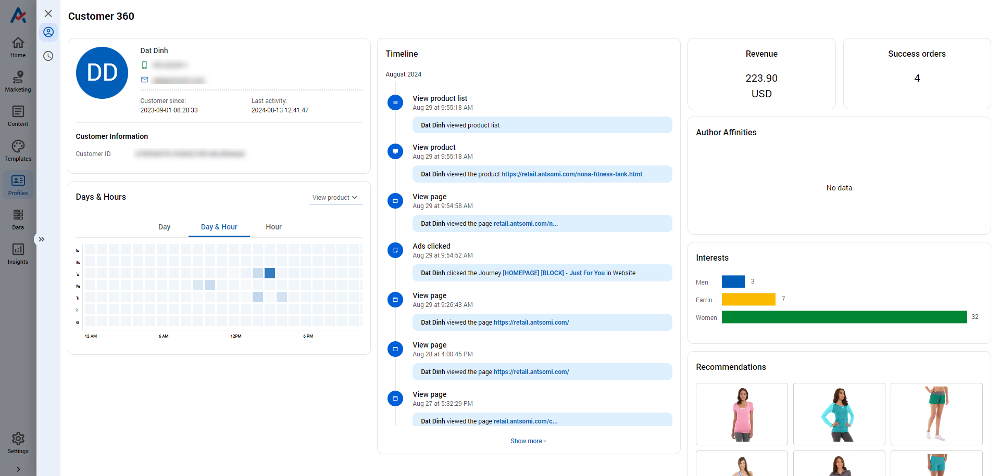

# Visitors & Customers

## INTRODUCE

Visitors and Customers are the Business Objects in CDP 365.&#x20;

The data tables of these apps provide

* An overview of the visitors or customers data&#x20;
* Details of a visitor or a customer by clicking on a User ID or a Customer name.

If you want to create a new attribute, go to Data Hub.

If you want to make data confidential, go to Portal Settings. &#x20;

## VISITORS/ CUSTOMERS

### Data table

<figure><figcaption></figcaption></figure>

<figure><figcaption></figcaption></figure>

### Remove Visitors/ Customers

You are able to delete the data as long as you have "Everything" permission on this menu. (To know more details, read [this article](https://docs.antsomi.com/cdp-365-user-guide-en/portal-settings/accounts#permission))

To delete the data of Visitors/ Customers, follow these steps:

1. Choose the row(s) you want to delete
2. Click on EDIT & choose Remove

<figure><figcaption></figcaption></figure>

3. Enter your account password to confirm the action. After clicking confirm, the system will start deleting the data so it would take a certain amount of time.

<figure><figcaption></figcaption></figure>


You could also perform this action in the Data Table of each [Business Objects](https://docs.antsomi.com/cdp-365-user-guide-en/data-hub/business-objects/business-objects/data-table#remove-data)


### Explore Visitors/ Customers

<figure><figcaption>
Explore button
</figcaption></figure>

Explore function allows you to have an overview of the data. Here you can analyze objects by creating charts yourself or using the system's built-in templates.

<figure><figcaption></figcaption></figure>

* In Explore pop up, you can add charts or drag and drop to change the dimensions and metrics as desired.
* Click on  to Save this explore become Private template (only you can view and edit) or Public template (everyone can view and use.)  Or select Manage template to view all template you can view.

## AUDIENCE PROFILE

Audience profile is classified into Visitor profile and Customer profile.&#x20;

Not only CDP 365 provides a 365-degree picture of a visitor or a customer but also indicates the relationship between a customer profile and visitor profiles which represents a unique user.

### **Visitor profile**

A visitor profile has an Activities tab that provides

* Visitor Information: ID, the last updated date of the audience's events, etc. &#x20;
* Identity Graph: The relationship between a customer and other visitors
* Product recommendations: The results are proposed based on the events of the visitor or the customer
* Timeline: Detailed events that the visitor or the customer has taken
* Searches: Keywords that the visitor or the customer has searched on domains.

<figure><figcaption></figcaption></figure>

### **Customer profile**

A customer profile has two tabs: Overview and Activities.

The Activities tab provides as similar content as the Activities tab of a Visitor Profile.&#x20;

The Overview tab provides a statistical report of the customer's events.

* Days & Hours&#x20;
* Devices
* Activity Distributions
* Brand Affiliates
* Interests
* Revenue
* Success Orders

<figure><figcaption></figcaption></figure>

You are able to know the Journey name where an event happened and also the provided Promotion code. As a result, the profile provides an in-depth understanding of the audience for future marketing strategies.

<figure><figcaption></figcaption></figure>

## USE CASES

### [How to add new and update Customers to CDP ](../../use-cases/personas/visitors-customers/how-to-add-new-and-update-customers-to-cdp.md)

### [How to create a Customer Custom Attribute](../../use-cases/personas/visitors-customers/how-to-create-a-customer-custom-attribute.md)

### [How to create a Customer Computed-Last Attribute](../../use-cases/personas/visitors-customers/how-to-create-a-customer-computed-last-attribute.md)

###
