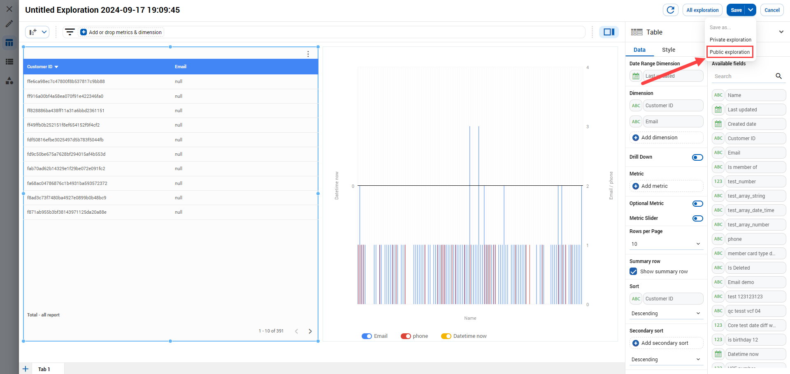

# Explore data

## CREATE A NEW EXPLORATION

To create a new exploration, first click on the **Explore** icon \[1] and then select the **Create a new exploration** option.

<figure><figcaption></figcaption></figure>

### Chart list

Click on \[1] and choose the type of chart you wish to use for visualizing data at \[2]. We offer a wide range of chart types including table, scorecard, line chart, pie chart, geo map, area chart, scatter chart, pivot chart, bullet chart, tree map, sunburst chart and heat map.

It's important to remember that each chart has its own specific configuration and style.

<figure><figcaption></figcaption></figure>

### Dimension & Metric

Within **Available fields**, you'll find attributes linked to the **Customer** data object for customer data, or attributes tied to the **Visitor** data object for visitor data. Utilize dimensions and metrics to set up the rules for your chart.

<figure><figcaption></figcaption></figure>

### Save exploration

After editing your exploration, click **Save** to store it for usage in the future. We provide two save options including **Private exploration** and **Public exploration**.

* **Private exploration**: only you have access to view the exploration
* **Public exploration**: share your exploration with other accounts

If you click **Save** button, the system will save your exploration as a private exploration.&#x20;

<figure><figcaption></figcaption></figure>

## CHECK YOUR EXPLORATION

Click the **All exploration** button to open the exploration list.

<figure><figcaption></figcaption></figure>

**My exploration** tab displays explorations you have created, while **Public on Portal** tab showcases explorations shared by other accounts.

<figure><figcaption></figcaption></figure>

In addition, you can also view the exploration list by selecting **See all saved explorations** option \[1]. We  will suggest three explorations you accessed recently at \[2].

<figure><figcaption></figcaption></figure>
