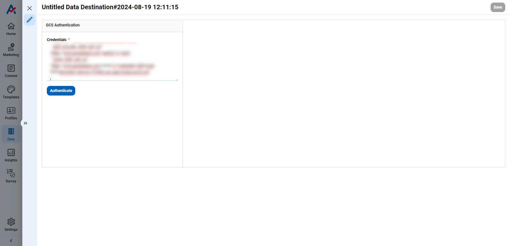

# How to upload segment data into Google Ad Manager (GAM) 360 using Dataflow?

The Google Ad Manager 360 (GAM 360) destination allows you to batch upload identifiers to audience segments in bulk by sending your desired segments to an Ad Manager cloud storage bucket. The segments appear as [a CSV file](how-to-upload-segment-data-into-google-ad-manager-gam-360-using-dataflow.md#example-exported-file), which you can then use in GAM 360.

## Prerequisites

Before you can use Antsomi to batch upload your identifiers to GAM 360, ensure you've completed these steps, taken from [Google Ad Manager Help](https://support.google.com/admanager/answer/4349785/):

1. Locate and submit your network code. Find your network code in Ad Manager under **Admin** -> **Global settings** -> **Network code**.
2. Ensure that you've created an active first-party audience segment with which you want to associate the identifiers. If you don't want this segment to collect users using your own inventory, select "Publisher Managed" as the Population method.


Expect to wait up for 24 hours from the time of segment creation to the time when you can perform batch upload.


3. [Create a Google Group](https://support.google.com/groups/answer/2464926) that contains all Google Accounts that will have access to upload and view files.
4. Inject your Antsomi Website SDK to your website source code.


If you haven't injected the Antsomi SDK, please follow these [instructions](https://docs.antsomi.com/developers-guide/website/getting-started).


5. In your website source code, include the following code snippets in the GAM360 function (in the function `googletag.cmd.push()` and before the statement `googletag.enableServices();`).



```html
<script>
    window.googletag = window.googletag || {cmd: []};
    googletag.cmd.push(function() {
        googletag.defineSlot('/16055XXXX,2310342YYYY/example.com/Multibanner1', [[300,250],[320,50]], 'div-gpt-ad-8144AAA-Z').addService(googletag.pubads());
        googletag.defineSlot('/16055XXXX,2310342YYYY/example.com/Multibanner1', [[320,100],[320,50]], 'div-gpt-ad-8144AAA-U').addService(googletag.pubads());
        googletag.defineSlot('/16055XXXX,2310342YYYY/example.com/Multibanner1', [[336,280],[300,250],[300,600]], 'div-gpt-ad-8144AAA-V').addService(googletag.pubads());

        googletag.pubads().enableSingleRequest();
        googletag.pubads().collapseEmptyDivs();
        googletag.pubads().setCentering(true);

        // <-- Add this snippet
        var getCookie=function(e){return(cookieMatch=RegExp("(^|;)[ ]*"+e+"=([^;]*)").exec(document.cookie))?window.decodeURIComponent(cookieMatch[2]):0};
        var md5=function($){function _($,_){return $<<_|$>>>32-_}function x($,_){var x,r,F,n,C;return(F=2147483648&$,n=2147483648&_,x=1073741824&$,r=1073741824&_,C=(1073741823&$)+(1073741823&_),x&r)?2147483648^C^F^n:x|r?1073741824&C?3221225472^C^F^n:1073741824^C^F^n:C^F^n}function r($,_,x){return $&_|~$&x}function F($,_,x){return $&x|_&~x}function n($,_,x){return $^_^x}function C($,_,x){return _^($|~x)}function t($,r,F,n,C,t,A){var D,E,o;return $=x($,x(x((D=r,E=F,D&E|~D&(o=n)),C),A)),x(_($,t),r)}function A($,r,F,n,C,t,A){var D,E,o;return $=x($,x(x((D=r,E=F,D&(o=n)|E&~o),C),A)),x(_($,t),r)}function D($,r,F,n,C,t,A){var D,E,o;return $=x($,x(x((D=r,E=F,D^E^(o=n)),C),A)),x(_($,t),r)}function E($,r,F,n,C,t,A){var D,E,o;return $=x($,x(x((D=r,E=F,E^(D|~(o=n))),C),A)),x(_($,t),r)}function o($){var _,x,r="",F="";for(x=0;x<=3;x++)r+=(F="0"+(_=$>>>8*x&255).toString(16)).substr(F.length-2,2);return r}var e,B,u,f,a,c,i,h,v,d=[];for(e=0,d=function $(_){for(var x,r=_.length,F=r+8,n=((F-F%64)/64+1)*16,C=Array(n-1),t=0,A=0;A<r;)x=(A-A%4)/4,t=A%4*8,C[x]=C[x]|_.charCodeAt(A)<<t,A++;return x=(A-A%4)/4,t=A%4*8,C[x]=C[x]|128<<t,C[n-2]=r<<3,C[n-1]=r>>>29,C}($=function $(_){_=_.replace(/\r\n/g,"\n");for(var x="",r=0;r<_.length;r++){var F=_.charCodeAt(r);F<128?x+=String.fromCharCode(F):F>127&&F<2048?(x+=String.fromCharCode(F>>6|192),x+=String.fromCharCode(63&F|128)):(x+=String.fromCharCode(F>>12|224),x+=String.fromCharCode(F>>6&63|128),x+=String.fromCharCode(63&F|128))}return x}($)),c=1732584193,i=4023233417,h=2562383102,v=271733878;e<d.length;e+=16)B=c,u=i,f=h,a=v,c=t(c,i,h,v,d[e+0],7,3614090360),v=t(v,c,i,h,d[e+1],12,3905402710),h=t(h,v,c,i,d[e+2],17,606105819),i=t(i,h,v,c,d[e+3],22,3250441966),c=t(c,i,h,v,d[e+4],7,4118548399),v=t(v,c,i,h,d[e+5],12,1200080426),h=t(h,v,c,i,d[e+6],17,2821735955),i=t(i,h,v,c,d[e+7],22,4249261313),c=t(c,i,h,v,d[e+8],7,1770035416),v=t(v,c,i,h,d[e+9],12,2336552879),h=t(h,v,c,i,d[e+10],17,4294925233),i=t(i,h,v,c,d[e+11],22,2304563134),c=t(c,i,h,v,d[e+12],7,1804603682),v=t(v,c,i,h,d[e+13],12,4254626195),h=t(h,v,c,i,d[e+14],17,2792965006),i=t(i,h,v,c,d[e+15],22,1236535329),c=A(c,i,h,v,d[e+1],5,4129170786),v=A(v,c,i,h,d[e+6],9,3225465664),h=A(h,v,c,i,d[e+11],14,643717713),i=A(i,h,v,c,d[e+0],20,3921069994),c=A(c,i,h,v,d[e+5],5,3593408605),v=A(v,c,i,h,d[e+10],9,38016083),h=A(h,v,c,i,d[e+15],14,3634488961),i=A(i,h,v,c,d[e+4],20,3889429448),c=A(c,i,h,v,d[e+9],5,568446438),v=A(v,c,i,h,d[e+14],9,3275163606),h=A(h,v,c,i,d[e+3],14,4107603335),i=A(i,h,v,c,d[e+8],20,1163531501),c=A(c,i,h,v,d[e+13],5,2850285829),v=A(v,c,i,h,d[e+2],9,4243563512),h=A(h,v,c,i,d[e+7],14,1735328473),i=A(i,h,v,c,d[e+12],20,2368359562),c=D(c,i,h,v,d[e+5],4,4294588738),v=D(v,c,i,h,d[e+8],11,2272392833),h=D(h,v,c,i,d[e+11],16,1839030562),i=D(i,h,v,c,d[e+14],23,4259657740),c=D(c,i,h,v,d[e+1],4,2763975236),v=D(v,c,i,h,d[e+4],11,1272893353),h=D(h,v,c,i,d[e+7],16,4139469664),i=D(i,h,v,c,d[e+10],23,3200236656),c=D(c,i,h,v,d[e+13],4,681279174),v=D(v,c,i,h,d[e+0],11,3936430074),h=D(h,v,c,i,d[e+3],16,3572445317),i=D(i,h,v,c,d[e+6],23,76029189),c=D(c,i,h,v,d[e+9],4,3654602809),v=D(v,c,i,h,d[e+12],11,3873151461),h=D(h,v,c,i,d[e+15],16,530742520),i=D(i,h,v,c,d[e+2],23,3299628645),c=E(c,i,h,v,d[e+0],6,4096336452),v=E(v,c,i,h,d[e+7],10,1126891415),h=E(h,v,c,i,d[e+14],15,2878612391),i=E(i,h,v,c,d[e+5],21,4237533241),c=E(c,i,h,v,d[e+12],6,1700485571),v=E(v,c,i,h,d[e+3],10,2399980690),h=E(h,v,c,i,d[e+10],15,4293915773),i=E(i,h,v,c,d[e+1],21,2240044497),c=E(c,i,h,v,d[e+8],6,1873313359),v=E(v,c,i,h,d[e+15],10,4264355552),h=E(h,v,c,i,d[e+6],15,2734768916),i=E(i,h,v,c,d[e+13],21,1309151649),c=E(c,i,h,v,d[e+4],6,4149444226),v=E(v,c,i,h,d[e+11],10,3174756917),h=E(h,v,c,i,d[e+2],15,718787259),i=E(i,h,v,c,d[e+9],21,3951481745),c=x(c,B),i=x(i,u),h=x(h,f),v=x(v,a);return(o(c)+o(i)+o(h)+o(v)).toLowerCase()};

        var ppid = getCookie("_asm_uid");
        if (ppid && ppid != "") {
            googletag.pubads().setPublisherProvidedId(md5(ppid));
        }
        // end -->

        googletag.enableServices();
    });
</script>
```




The `_cdpEventFunction` is a utility object from the Antsomi Website SDK, please kindly wait for the SDK script to be fully loaded and check for its existence before using it.


Once your account manager has completed your setup, you can create the file of identifiers you want to upload.

## Connect to Google Cloud Storage (GCS)

1. Log into the CDP system. After logging in, click the menu in the left corner of the screen
2. Go to menu: **DATAFLOWS** -> **Data Destinations**

<figure><figcaption></figcaption></figure>

3. Click the  **Add destination** button. Select **Google Cloud Storage**.

<figure><figcaption></figcaption></figure>

3. You can then authenticate Antsomi to Google Ad Manager 360 by entering your **GCP Credentials**.


If you need to create a cloud credential, consult the guide from Google [documentation](https://developers.google.com/workspace/guides/create-credentials).


3. After validated successfully, input the Destination name and click the **Connect** button.

<figure><figcaption></figcaption></figure>

## Prepare your Visitor Segments


Skip this step if you have your segment(s) already.


Please follow the steps in this [document](../../personas/segments.md).

## Prepare your Segment Data Source


Skip this step if you have your Segment Data Source already.


Please follow the steps in this [document](how-to-create-a-segment-data-source.md).

## Create the upload file

Once you've set up your Google Ad Manager 360 Destination and have a Segment(s) Data Source to pull data from, you can set up your dataflow to begin syncing data.&#x20;

1. Go to the **Dataflows** -> **Batch Streaming** page and click the  **Blank Dataflow** button to begin.&#x20;

<figure><figcaption></figcaption></figure>

2. Select the relevant Segment data source where you want to pull data from, then click **Create dataflow**.


### 1. Add Data

Select your desired segment(s) and the field "User ID".

<figure><figcaption></figcaption></figure>

### 2. Add Columns

In the next step, you need to denote the audience segment IDs with which the identifiers from the previous step should be associated. You need to specify a static value to associate all identifiers with the same segment.&#x20;

#### List of identifiers

We only supports this identifier type of the GAM 360:

<table><thead><tr><th width="130">Identifier</th><th width="185">Description</th><th width="215">Source</th><th>Upload as</th></tr></thead><tbody><tr><td>PPID</td><td>Publisher provided identifiers</td><td>Raw (external source)</td><td><mark style="color:green;">ppid</mark></td></tr></tbody></table>

1. Click  **Add New Node** -> .
2. Input the column names, following this setup:

<table><thead><tr><th width="188">Column Name</th><th width="118">Data Type</th><th>Formula</th></tr></thead><tbody><tr><td>ppid</td><td>Text</td><td><p>Select the field "User ID"</p><p></p><p></p></td></tr><tr><td>list_id</td><td>Text</td><td><p>Static value</p><p><br></p></td></tr><tr><td>process_consent</td><td>Text</td><td><p>Static empty string: ''</p><p></p><p></p></td></tr></tbody></table>

### 3. Select Columns

To ensure the uploading file is in the correct format that GAM360 can read and process, you need to specify only the required columns.

1. Click  **Add New Node** -> .
2. From the list of available columns, select 3 columns: "ppid", "list\_id", and "process\_consent".

<figure><figcaption></figcaption></figure>

### 4. Export data to GCS

The GCS destination lets you specify the bucket name, the parent directory, and the name of the file you want to use for your results.&#x20;

You can include timestamp variables in the filename, surrounding each with `{}`. Antsomi supports these timestamp variables:

* `timestamp`: Unix timestamp in milliseconds.
* `year`: Represents the full year in four digits.
* `month`: Two-digit month format (01-12).
* `day`: Two-digit day format (01-31).
* `hour`: Two-digit hour format in the 24-hour clock (00-23).
* `minute`: Two-digit minute format (00-59).

All dates and times are GMT +8 (Singapore timezone).

<figure><figcaption></figcaption></figure>


If a file already exists at the path you entered at the time of a sync, Antsomi will overwrite it.


## Example exported file

Example file content:


```csv
ppid,list_id,process_consent
0b96df113fd7a881ea7f8e5681c816c1,3153490,
a8fc1749045aa359d2b576fdccd296cc,3153490,
```

