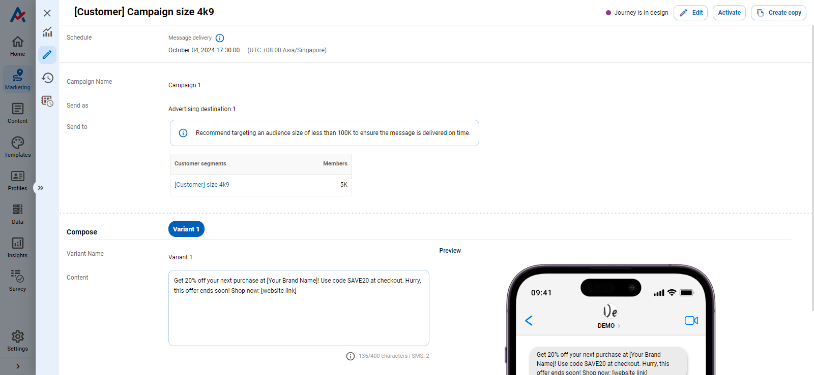
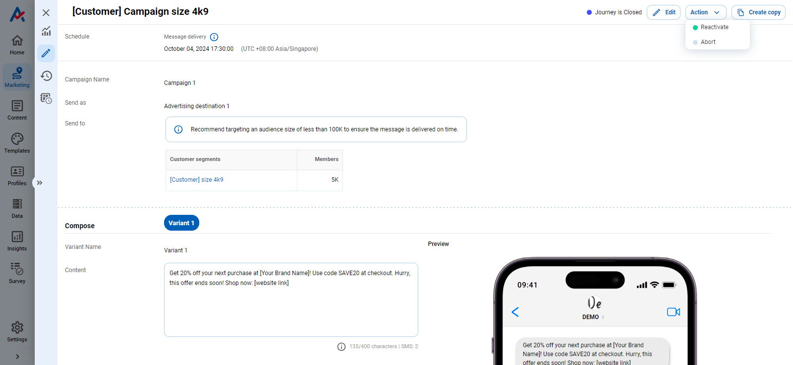

# How do I set up an advertising SMS campaign using the SMS FPT destination?

**Example: Set up a campaign to send advertising messages to 4999 customers by using 'SMS FPT' destination.**

## Step 1: Create a new advertising SMS FPT campaign

Messages are expected to be sent to customers on October 4, 2024, at 5:30 PM, using 'Advertising destination 1' for sending and targeting a segment of 4,999 customers.

<figure><figcaption></figcaption></figure>

Targeted customers will receive the message: 'Get 20% off your next purchase at \[Your Brand Name]! Use code SAVE20 at checkout. Hurry, this offer ends soon! Shop now: \[website link]'

<figure><figcaption></figcaption></figure>

## Step 2: Activate the campaign

Click **Save** to confirm the creation of a new campaign.

<figure><figcaption></figcaption></figure>

Click **Activate** to run the campaign.

<figure><figcaption></figcaption></figure>

## Step 3: Monitor the campaign result

Go to the **Schedule History** tab and click on the **Schedule ID** to view the details of the campaign run.

<figure><figcaption></figcaption></figure>

You can verify the status of the process (each process corresponds to a specific audience).

<figure><figcaption></figcaption></figure>

## Step 4: Reactive the campaign

Click **Reactivate** to run the campaign again.

<figure><figcaption></figcaption></figure>

## Modify the campaign in certain situations

### Error "Số lượng tin nhắn gửi đã vượt hạn mức cho phép"

This error occurs when the quota is insufficient to send messages. To resolve this issue, the client must contact the vendor to request a new quota.

Note: This issue does not originate from CDP 365.

<figure><figcaption></figcaption></figure>

### Error "Thời gian gửi tin nhắn không đúng quy định"

When users schedule message delivery, the time is too short for the size of the target audience. To resolve this, simply select a longer delivery schedule and run again for audiences experiencing this error.

<figure><figcaption></figcaption></figure>

### Error "Địa chỉ ip "{your ip address}" là không phù hợp"

FPT vendor has a mechanism which only allows to send message from an IP address approved to protect for client's account from hacking. As a result, clients need to provide their IP address for the vendor before using the service.

Note: This issue does not originate from CDP 365.

<figure><figcaption></figcaption></figure>
