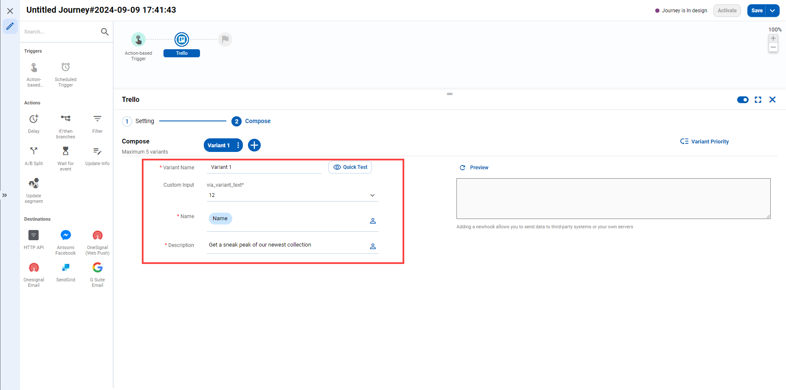

# How to create a "Trello Card" using CDP 365

## .png>) Create destination Trello

For creating **Trello** card purpose, destination Trello has been designed and implemented.

Destination Trello is in the **Webhook** channel.

<figure><figcaption></figcaption></figure>

For using this destination, some information are required as follow:

* App-key and token
* List ID
* Member ID

<figure><figcaption></figcaption></figure>

#### App-key and token

App-key and token can be obtained from the website : [https://trello.com/app-key](https://trello.com/app-key)

<figure><figcaption></figcaption></figure>

#### List ID and Member ID

* List ID: where the Trello Card will be created&#x20;
* Member ID: which member will be assigned to the card. You can add more than 1 member ID and separate them with commas

In order to get **List ID** and **Member ID**, you can follow the instructions below:

1. Go to your Trello board&#x20;
2. Add "**.json**" to end of the URL
3. Format the JSON so it's readable (you can find a JSON viewer online)
4. Search for **List ID** and **Member ID**

<figure><figcaption></figcaption></figure>

<figure><figcaption></figcaption></figure>

<figure><figcaption></figcaption></figure>

<figure><figcaption></figcaption></figure>

## .png>) Set up journey to create a Trello Card

1\. Hover your mouse over **Marketing >>** Choose **Orchestration**

<figure><figcaption></figcaption></figure>

2\.  Click icon .png>) to create journey

<figure><figcaption></figcaption></figure>

3\.  Select the account you want to create Journeys on.

4\. Set up the necessary information for Journey

<figure><figcaption></figcaption></figure>

5\.  Add destination Trello

<figure><figcaption></figcaption></figure>

6\. Choose the correct destination that users want to create the Trello Card

<figure><figcaption></figcaption></figure>

7\. Enter the title and content of the Trello Card

* Name: title of the card
* Description: content of the card

<figure><figcaption></figcaption></figure>
