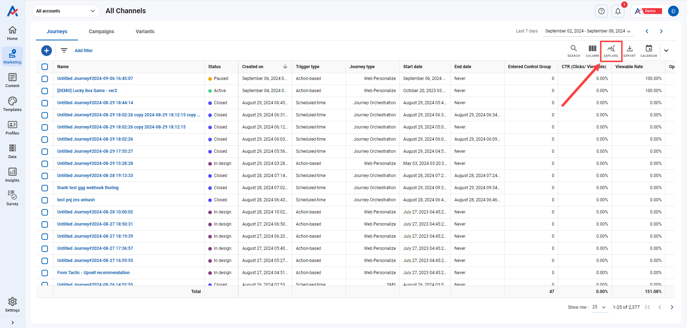
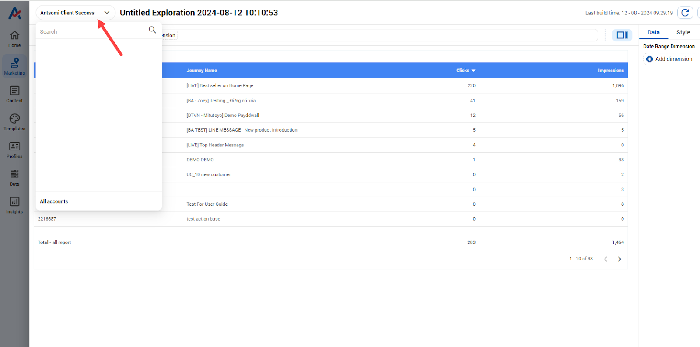

# How to explore Journeys?

## <mark style="color:red;">Navigate Explore button</mark>

* To explore Journeys, go to **Marketing**
* Choose the **Channel** you want to explore

<figure><figcaption></figcaption></figure>

### 1. Explore Journeys of all Channel

* After choosing **All Channel**, click Explore button to quickly analyze the performance of ALL Journeys
* If you want to explore specific Journeys, use Filter to take the Journeys -> Click **Explore**

<figure><figcaption></figcaption></figure>

### 2. Explore Journeys of a specific Channel

To explore ONLY the journeys of a specific channel, do as below:

* Choose a specific Channel you want to analyze -> Click **Explore** button

<figure><figcaption></figcaption></figure>

### 3. Explore a specific journey

To explore only 1 Journey you want, do as below:

* Hover to the Journey you want to explore --> Click on the .png>) icon&#x20;

## <mark style="color:red;">Using Explore Feature</mark>

When clicking on Explore button, a pop-up is shown as below:

<figure><figcaption></figcaption></figure>

* Create custom explore: Create a new board of exploration
* Recently viewed explore: The exploration you just made recently. If you have not created any exploration, it displays the Explore template
* See all Explore template: The templates provided by CDP 365 for all levels and separate level (Journeys/Campaigns/Variants)

After click on the options in the pop-up, a table will be created beforehand as below:

<figure><figcaption></figcaption></figure>

* Choose an account you want to use to view the data

<figure><figcaption></figcaption></figure>

When you choose a specific account to explore journeys instead of All account, the data is only shown if that account is the creator&#x20;

* To add another page, click the  button

<figure><figcaption></figcaption></figure>

* The setting of the visualization is on the right, the result is shown on the left. To see the setting of a specific visualization, click on it.&#x20;

-> Each type of visualization (table/chart) will have different settings. To know more, click [here](https://docs.antsomi.com/cdp-365-user-guide-en/insights/reports/create-reports/build-stylize-and-add-data-to-reports/chart-references).

<figure><figcaption></figcaption></figure>

* To add more chart, click .png>) button -> Choose the type you want

<figure><figcaption></figcaption></figure>

* To download/export the chart, click on the chart you want --> click .png>)button --> choose the method you want

<figure><figcaption></figcaption></figure>

* Click .png>) to save the template for future usage. Click .png>) to refresh the data.&#x20;

<figure><figcaption></figcaption></figure>

