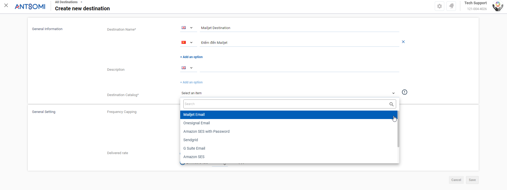
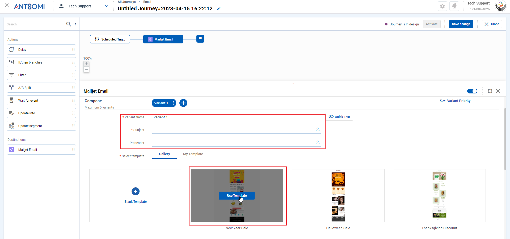

# How to send email using "Mailjet" in CDP 365?

## STEP 1 - Create "Mailjet" destination

### 1. Access the "MARKETING HUB" app and go to the "Destinations" menu

<figure><figcaption>
CDP 365 menu
</figcaption></figure>

### 2. Click .png>) button and select "Email"

<figure><figcaption>
Destination list
</figcaption></figure>

### 3. Fill in the necessary information for the destination

#### General Information

* Destination Name
* Description
* Destination Catalog: Choose _Mailjet Email_

_NOTE:_ You can add another language if you want by clicking .png>)

<figure><figcaption>
Destination Catalog
</figcaption></figure>

#### Configure fields

<figure><figcaption>
Configure fields
</figcaption></figure>

<table><thead><tr><th width="140.33333333333331">Fields</th><th width="259">Description</th><th>NOTE</th></tr></thead><tbody><tr><td>API Key</td><td>The key provided by Mailjet for your Mailjet account. </td><td>To know your API Key, follow the instructions <a href="how-to-send-email-using-mailjet-in-cdp-365.md#how-to-know-your-api-key-and-secret-key">here</a>.</td></tr><tr><td>Secret Key</td><td>The key generated by Mailjet. </td><td>To know your Secret Key, follow the instructions <a href="how-to-send-email-using-mailjet-in-cdp-365.md#how-to-know-your-api-key-and-secret-key">here</a>.</td></tr><tr><td>From Email Name</td><td>Sender Name</td><td>Required field</td></tr><tr><td>From Email Address</td><td>A regional email address that you verified with Mailjet.</td><td>Required field</td></tr><tr><td>Email</td><td>Receiver's email</td><td>
You can click  icon to add Personalization.

 It uses data available in CDP 365 to set the receivers configuration.
<ul><li>Personalization type: Visitor/Customer Attribute</li><li>Personalization attribute: List of attributes in Visitor/customer that you selected before</li><li>Default value: The default email address that will be used if a customer does not have an email</li></ul>
→ Example: Receiver email addresses are the email addresses in the BO Customer.  <mark style="background-color:red;">NOTE: You should add personalization so your receiver's email could be dynamic in the journey. If not, the journey could only send email to the address you put in here.</mark> --> Example:  Destination --> Email: abc@gmail.com Journey's audience: Customer segment When the journey run, email will be sent to abc@gmail.com only 
</td></tr></tbody></table>

#### How to know your API Key and Secret Key?

1. In Mailjet, open Account Settings at: [https://app.mailjet.com/account](https://app.mailjet.com/account)
2. Choose REST API section
3. Choose _Show icon_ - .png>)to see the information.&#x20;
4. Copy the keys and paste to the fields in CDP 365

_NOTE_:

* Secret Key: If you have not had it yet, click _Generate_ to create one. This key is only displayed once, so you should take it at that time. (If not, you must choose _Reset_ to have another key)

#### General Setting

<figure><figcaption>
General Setting
</figcaption></figure>

_Frequency Capping_

Frequency Capping settings allows users to limit the times an audiences receiving an email

<table><thead><tr><th width="262">Option</th><th>Description</th></tr></thead><tbody><tr><td>Ignore duplicate messages for the scheduled journey</td><td>One audience just receive one email in an iteration of journey schedule </td></tr><tr><td>Limit frequency for the journey (3 months duration)</td><td>
Limit allocation frequency to 1 audience in a journey for 3 months 

(Ex: 2 times/person)
</td></tr><tr><td>Limit frequency for destination</td><td>
Limit allocation frequency to 1 audience per unit of time (hour, day, etc.) 

(Ex: 3 times/month, 1 times/day)
</td></tr></tbody></table>

_Delivered rate_

Delivered rate setting allows users to limit the number of email sent per second&#x20;

<table><thead><tr><th width="333">Option</th><th>Description</th></tr></thead><tbody><tr><td>As fast as possible</td><td>The maximum number of email sent per second will depend on the system possibility.</td></tr><tr><td>Limit send rate {x} time(s) per second</td><td>
The number of email sent per second will be set by user. 

(Ex: The value you set is 100. That means only 100 emails will be sent in 1 second)
</td></tr></tbody></table>

### 4.  Click "Save"

<figure><figcaption></figcaption></figure>

## STEP 2 - Create a Customer Journey

### 1.  Access the "MARKETING HUB" app and go to the "Customer Journeys" menu

<figure><figcaption>
CDP 365 menu
</figcaption></figure>

### 2. Choose a Channel

We have 2 channels that supporting to send email:

* Email
* Journey Orchestration

<figure><figcaption></figcaption></figure>

### 3. Click .png>) to create a Journey

<figure><figcaption></figcaption></figure>

### 4. Add and configure _Destination_ node&#x20;

* Click .png>) to add Destination node --> Choose Mailjet Email

<figure><figcaption>
Destination node
</figcaption></figure>

* Choose the method to design the email

<figure><figcaption></figcaption></figure>

* Select a "Mailjet" destination that you have created in [Step 1](how-to-send-email-using-mailjet-in-cdp-365.md#step-1-create-mailjet-destination)

<figure><figcaption>
Delivery Destination
</figcaption></figure>

* Fill out necessary information

<figure><figcaption></figcaption></figure>

### 5. Save and activate the Journey

* Click "Save change" to save the Journey

<figure><figcaption></figcaption></figure>

* Click "Activate" to start running the Journey and sending email to customers

<figure><figcaption></figcaption></figure>
