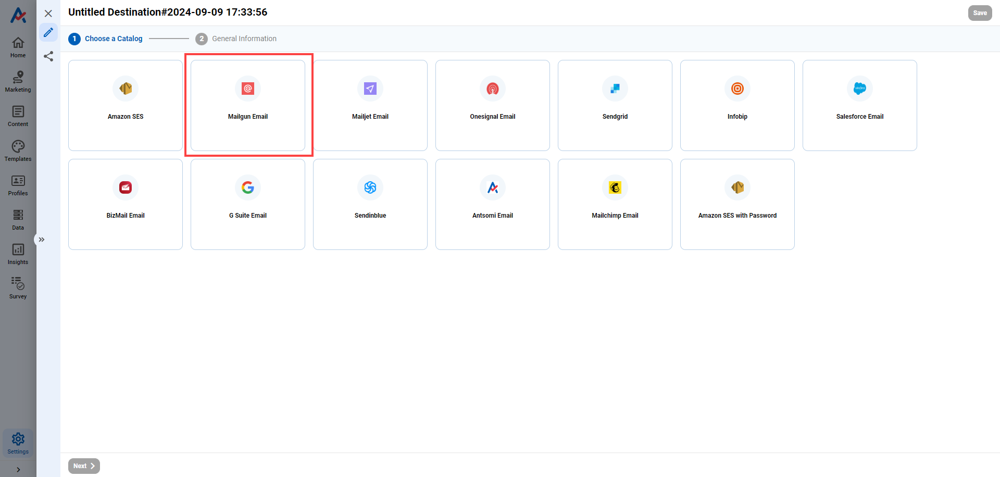

# How to send marketing email using Mailgun Destination?

## STEP 1: Create a Mailgun Destination

### 1. Open Destination app

* Hover your mouse over **Settings**. Open **Email** in **Channel Integration**

<figure><figcaption></figcaption></figure>

### 2. Click  .png>) to create a new Destination

<figure><figcaption></figcaption></figure>

### 3. Choose Catalog: Mailgun

<figure><figcaption></figcaption></figure>

### 4. Fill the necessary information

<figure><figcaption></figcaption></figure>

_**General information**_

* Destination Name: Input the name for the destination.
* Description: Input description for this destination (optional).
* Destination Catalog: Select **Mailgun Email** option.
* Method: Select **Send** (default).

#### _**Configure fields**_

* **API key:** To get this API key, follow these steps:

1. Log in to your **Mailgun** account, then select **Sending >> Overview >> Select**
2. Copy the API key as highlighted in below image

<figure><figcaption>
Get API key
</figcaption></figure>

* **Domain**: To get this item, follow these steps:

1. Log in to your Mailgun account, then select **Sending >> Domains**
2. Copy domain URL as highlighted in below image:

<figure><figcaption>
Get Domain
</figcaption></figure>

* **From email address**: Input the email used to send marketing message
* **Email:** Input the email you need to send marketing email to.

At this step, users can input email by email, or click on icon to use Personalization function. By clicking on that icon, a popup will be show up as below:

<figure><figcaption></figcaption></figure>

* **Personalization type**: Select **Customer Attribute** or **Visitor Attribute** depending on the target audience you are desire to send marketing messages.
* **Personalization Attribute**: Select **Email**
* Click **Insert** to save the setting. The result can be found as below:

<figure><figcaption></figcaption></figure>

#### General Setting

_**Frequency Capping**_

Frequency Capping settings allows users to limit the times an audiences receiving a marketing message.

<table><thead><tr><th width="262">Option</th><th>Description</th></tr></thead><tbody><tr><td>Ignore duplicate messages for the scheduled journey</td><td>One audience just receive one message in an iteration of journey schedule </td></tr><tr><td>Limit frequency for the journey (3 months duration)</td><td>
Limit allocation frequency to 1 audience in a journey for 3 months 

(Ex: 2 times/person)
</td></tr><tr><td>Limit frequency for destination</td><td>
Limit allocation frequency to 1 audience per unit of time (hour, day, etc.) 

(Ex: 3 times/month, 1 times/day)
</td></tr></tbody></table>

_**Delivered rate**_

Delivered rate setting allows users to limit the number of messages sent per second for a specific Destination.&#x20;

<table><thead><tr><th width="333">Option</th><th>Description</th></tr></thead><tbody><tr><td>As fast as possible</td><td>The maximum number of marketing messages sent per second will depend on the system possibility.</td></tr><tr><td>Limit send rate {x} time(s) per second</td><td>
The number of marketing messages sent per second will be set by user. 

(Ex: You are creating a destination for G Suite Email, the value you set is 100. That means only 100 emails will be sent per second.)
</td></tr></tbody></table>

### 5. Click .png>) to save the Destination

## STEP 2: Create a Customer Journey

### 1. Open Customer Journeys app

* Hover your mouse over **Marketing** -> Choose Channel **Email** or **Orchestration**

<figure><figcaption></figcaption></figure>

### 2. Select Email or Journey Orchestration channel, then click to create a new Customer Journey

<figure><figcaption></figcaption></figure>

### 3. Complete the setting of the Trigger node and Action node

* Drag  & drop the desire trigger node and action nodes in the Journey and finish the setting&#x20;

<figure><figcaption></figcaption></figure>

### 4. Add and configure Destination node

* Drag & drop the **Mailgun** Destination into the Journey, then select **Design from Email template** to create a new Destination

<figure><figcaption></figcaption></figure>

Then finish the settings of **Mailgun** Email as following:

<figure><figcaption></figcaption></figure>

#### Setting tab:

* Campaign Name: Input the name of this campaign
* Delivery Destination: Select the destination you created in **STEP 1**
* Delivery Algorithm: Randomization (default)
* Delivery Hours of the Day: Select the time of day you want to send this Email.

**Compose tab:**

<figure><figcaption></figcaption></figure>

Finish the setting of **Compose tab** as any other Email Destination.

### 5. Save and Activate the Journey

* Click **Save** and then click **Activate** to save and start running the Journey

<figure><figcaption></figcaption></figure>
