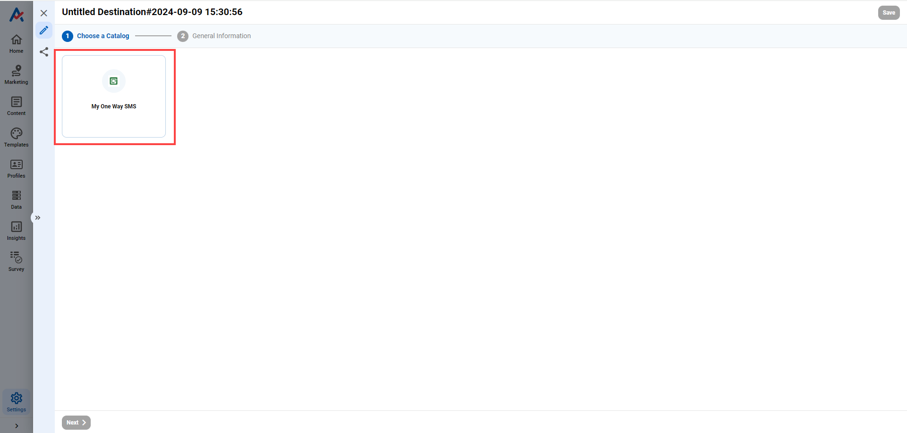

# How to send messages using OneWay SMS destination?

## STEP 1 - Create One Way destination

### 1. Open Channel Integration

Choose SMS Destination >> Create a new Destination

<figure><figcaption></figcaption></figure>

### &#x20;2. Click  .png>) to create a new Destination

<figure><figcaption></figcaption></figure>

### 3. Choose _SMS_ category

<figure><figcaption></figcaption></figure>

### 4. Fill the necessary information

<figure><figcaption></figcaption></figure>

_**General information**_

* Destination Name
* Description
* Destination Catalog: Choose My One Way SMS
* Method: Choose Send

_**Configure fields**_

* User Name: Your user name on One Way
* Password: Your password on One Way
* Phone: The receiver's phone number. You can make the receiver's phone number dynamic by clicking   icon. A pop-up will be shown below:

<figure><figcaption></figcaption></figure>

* Base URL: The URL of your account on One Way

#### General Setting

_**Frequency Capping**_

Frequency Capping settings allows users to limit the times an audiences receiving a marketing message.

<table><thead><tr><th width="262">Option</th><th>Description</th></tr></thead><tbody><tr><td>Ignore duplicate messages for the scheduled journey</td><td>One audience just receive one message in an iteration of journey schedule </td></tr><tr><td>Limit frequency for the journey (3 months duration)</td><td>
Limit allocation frequency to 1 audience in a journey for 3 months 

(Ex: 2 times/person)
</td></tr><tr><td>Limit frequency for destination</td><td>
Limit allocation frequency to 1 audience per unit of time (hour, day, etc.) 

(Ex: 3 times/month, 1 times/day)
</td></tr></tbody></table>

_**Delivered rate**_

Delivered rate setting allows users to limit the number of messages sent per second for a specific Destination.&#x20;

<table><thead><tr><th width="333">Option</th><th>Description</th></tr></thead><tbody><tr><td>As fast as possible</td><td>The maximum number of marketing messages sent per second will depend on the system possibility.</td></tr><tr><td>Limit send rate {x} time(s) per second</td><td>
The number of marketing messages sent per second will be set by user. 

(Ex: You are creating a destination for G Suite Email, the value you set is 100. That means only 100 emails will be sent per second.)
</td></tr></tbody></table>

### 5. Click Save to save the Destination

## STEP 2: Create a Customer Journey

### 1. Hover your mouse over Marketing

* Choose **Orchestration**

<figure><figcaption></figcaption></figure>

Or Marketing >> SMS

<figure><figcaption></figcaption></figure>

### 2. Click + button to create a new Customer Journey.&#x20;

### Then configure the Trigger Node

<figure><figcaption></figcaption></figure>

**Journey schedule**

_Trigger Journey_

* Once: The journey will run only 1 time
* By hour/day/week/month: The Journey will run hourly/ daily/ weekly/ monthly

<figure><figcaption></figcaption></figure>

_Trigger time -_ The time Journey will start running

<figure><figcaption></figcaption></figure>

* At a specific date & time: Choose the date and time the journey will start
* Right after the journey activated: The journey will run after you click **Activate**

**Include/ Exclude Audiences**

* Choose the audiences who are able/not able to go to the Journey
* Click or  to add audiences

<figure><figcaption></figcaption></figure>

**General Settings**

Limit the time an audience would receive a ticket

* Unlimited frequency: The audience will receive as many ticket as the journey run
* Limited frequency: The audience will receive {x} ticket per day/week/month/lifetime

### 3. Add Action node (optional)

<figure><figcaption></figcaption></figure>

### 4. Add and configure Destination node

Click + to add Destination node -> Choose **My One Way SMS**

<figure><figcaption></figcaption></figure>

Choose **Design from scratch**

<figure><figcaption></figcaption></figure>

Design the campaign:

1. _**Settings**_

<figure><figcaption></figcaption></figure>

* Campaign Name
* Delivery Destination: Choose the destination you created in [STEP 1](how-to-send-messages-using-oneway-sms-destination.md#step-1-create-one-way-destination)
* Delivery Algorithm
* Delivery Hours of the Day: Choose the time you want to send the messages

2. _**Compose**_

<figure><figcaption></figcaption></figure>

* Variant Name: The name of the message template
* Content: The content of the message. You could make your content dynamic by clicking .png>) icon

<figure><figcaption></figcaption></figure>

### 5. Save and Activate the Journey

* Click **Save** to save the Journey

<figure><figcaption></figcaption></figure>

* Click **Activate** to start running the Journey

<figure><figcaption></figcaption></figure>

