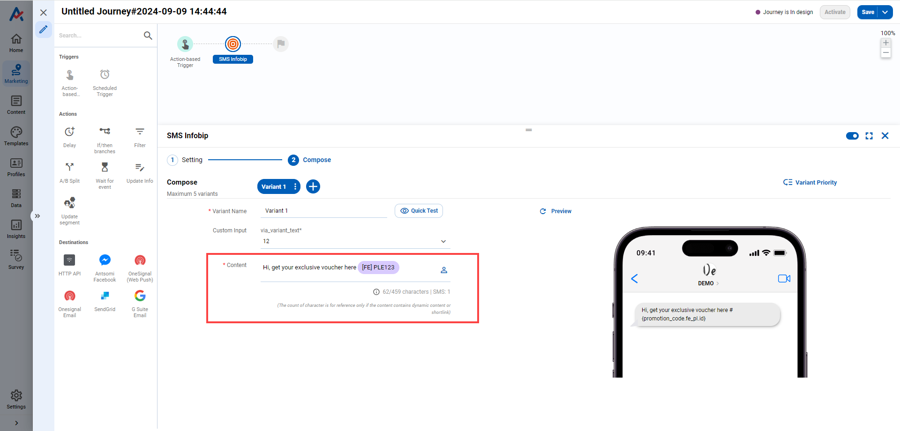

# How to set up a campaign using SMS channel

### 1. Hover your mouse over Settings and access Line under Channel Integration

<figure><figcaption></figcaption></figure>

### 2. Click + button

<figure><figcaption></figcaption></figure>

### 3. Select Destination catalog

<figure><figcaption></figcaption></figure>

### 4. Fill in the necessary information for the destination

<figure><figcaption></figcaption></figure>

Depending on the selected catalog, the corresponding configuration field list will be displayed

### 5. Save to finish creating destination

<figure><figcaption></figcaption></figure>

### 6. Sending SMS via Customer Journey

Log into CDP 365 system,  access **Marketing**

We have 2 channels that supporting to send SMS

* SMS
* Orchestration

<figure><figcaption></figcaption></figure>

Click **+** button to Create Journey, add **Destination** node and select a **SMS** destination

<figure><figcaption></figcaption></figure>

Fill out necessary information

<figure><figcaption></figcaption></figure>

Click **Save** button to finish setting journey

<figure><figcaption></figcaption></figure>

After finishing the setting of the Journey, we can activate and send SMS to customer.
