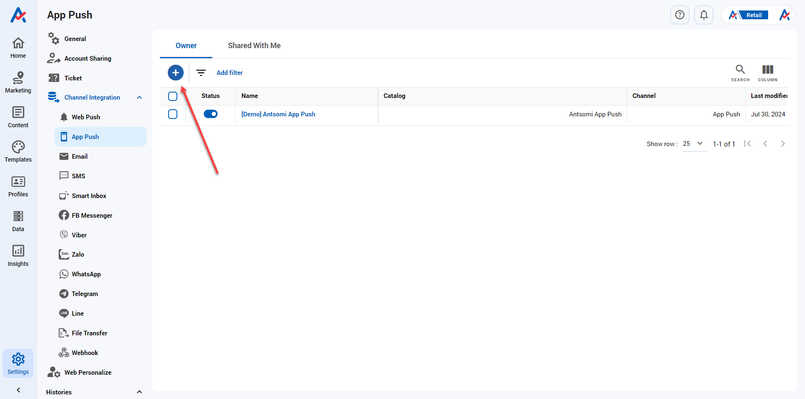
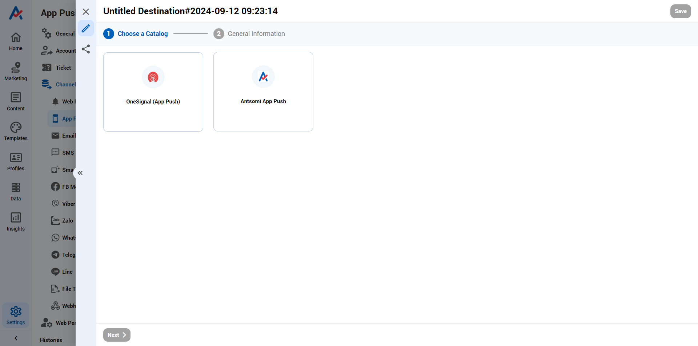
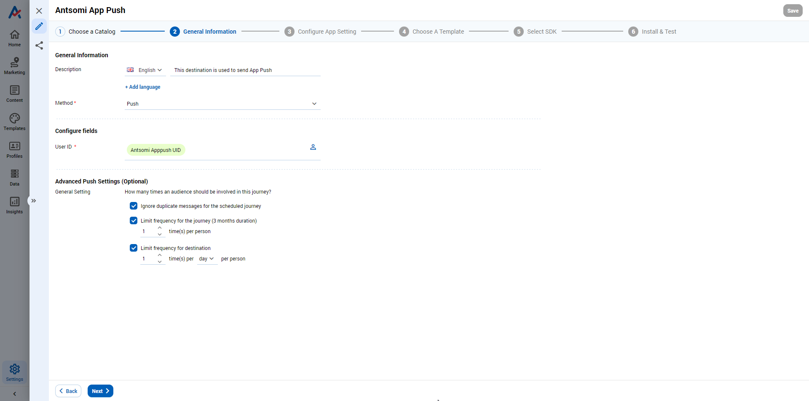
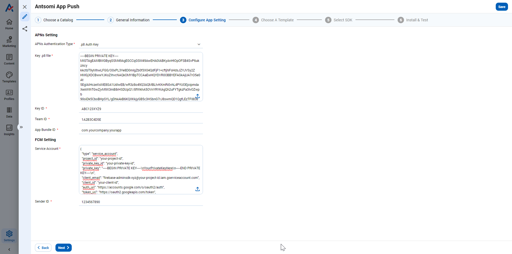
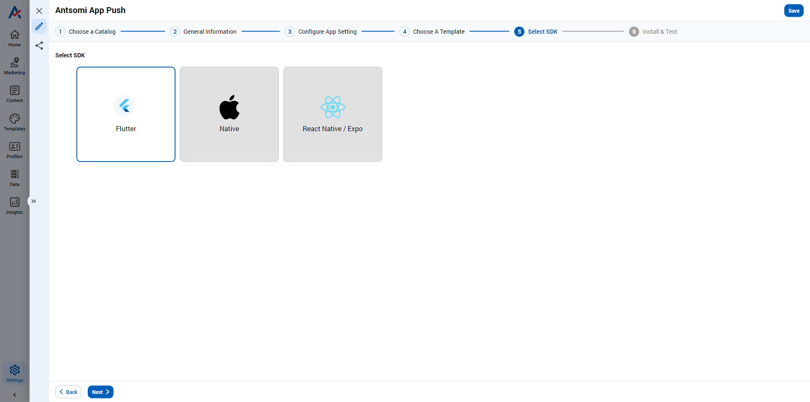
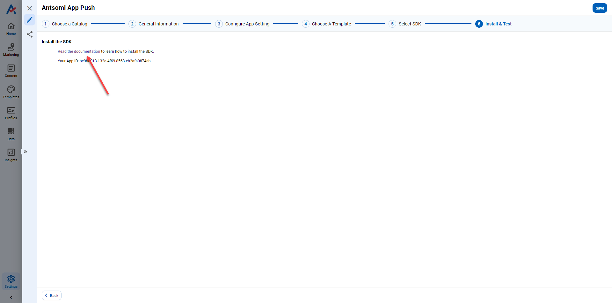
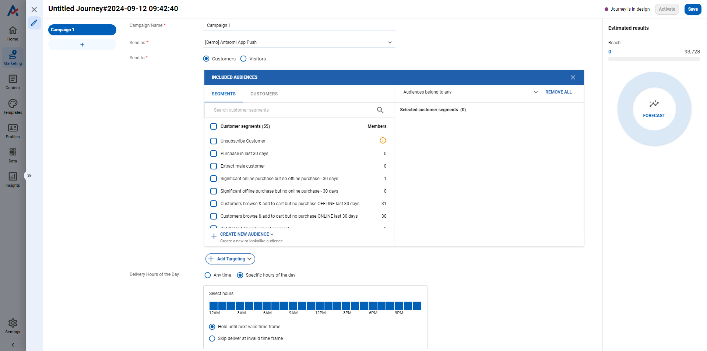

# How to setup a campaign using App Notification channel?

Create Antsomi App Push Destination

Antsomi App Notification destination will later be used in Customer Journeys, where you could configure the content and the targeted audience.&#x20;

Please follow these step:

### 1. Open SETTINGS >> Channel Integration >> App Push, then click Create

<figure><figcaption>
App Notification channel
</figcaption></figure>

### 2. Choose Antsomi App Push in Destination Catalog

<figure><figcaption></figcaption></figure>


You can create only ONE destination with Antsomi App Push catalog


### 3. Input the necessary information of the destination

#### STEP 1 - General Information

<figure><figcaption></figcaption></figure>

**General Information**

<table><thead><tr><th width="225">Field's name</th><th>Description</th></tr></thead><tbody><tr><td>Destination Name</td><td>Name your destination as you want</td></tr><tr><td>Description</td><td>Describe this destination. Usually, it would be the objective of this destination</td></tr><tr><td>Destination Catalog</td><td>Choose the catalog "Antsomi App Push"</td></tr><tr><td>Method</td><td>It is "Push" automatically</td></tr></tbody></table>

**Configure fields**

<table><thead><tr><th width="341.3333333333333">Field's name</th><th>Description</th></tr></thead><tbody><tr><td>User ID</td><td><ul><li>Choose the target audience &#x26; the identity attribute. For this destination, you should choose attribute "Antsomi App Push UID" of BO Visitor. </li></ul><ul><li>To add an attribute, click on  button, and choose in the popup. </li></ul></td></tr></tbody></table>

**Advanced Push Settings (Optional)**

#### General Setting

_**Frequency Capping**_

Frequency Capping settings allows users to limit the times an audiences receiving a marketing message.

<table><thead><tr><th width="262">Option</th><th>Description</th></tr></thead><tbody><tr><td>Ignore duplicate messages for the scheduled journey</td><td>One audience just receive one message in an iteration of journey schedule </td></tr><tr><td>Limit frequency for the journey (3 months duration)</td><td>
Limit allocation frequency to 1 audience in a journey for 3 months 

(Ex: 2 times/person)
</td></tr><tr><td>Limit frequency for destination</td><td>
Limit allocation frequency to 1 audience per unit of time (hour, day, etc.) 

(Ex: 3 times/month, 1 times/day)
</td></tr></tbody></table>

#### STEP 2 - Configure App Setting&#x20;

<figure><figcaption></figcaption></figure>

To understand the meaning of these fields, read this [article](https://docs.antsomi.com/cdp-365-user-guide-en/marketing-hub/destinations/all-destinations/app-push-notification#antsomi-app-notification).

#### STEP 3 - Choose a template

Select the templates you want to use to send to audience. By default, all templates are chosen.

<figure><figcaption></figcaption></figure>

#### STEP 4 - Select SDK

The SDK selected here must match with the SDK on Firebase & Apple.

<figure><figcaption></figcaption></figure>

#### STEP 5 - Install & Test

* Click on the document linked and follow the instruction to install and test the destination
* Follow the link to "Read the documentation" and copy **Your App ID** as this will be the ID that allows your mobile application to connect to the destination.

<figure><figcaption></figcaption></figure>

## Create a Journey using App Notification channel

### 1. Open MARKETING HUB >> Customer Journeys >> App Push

<figure><figcaption></figcaption></figure>

<figure><figcaption></figcaption></figure>

<figure><figcaption></figcaption></figure>

<figure><figcaption></figcaption></figure>

<figure><figcaption></figcaption></figure>

<figure><figcaption></figcaption></figure>

Do as the following to create a Blast Campaign using Antsomi App Push

<figure><figcaption></figcaption></figure>


If you want to trigger Journey by Action-based node, choose Journey Orchestration channel instead


### 2. Configure and input the content of the app notification

**STEP 1 - Settings**

* Campaign Name: Input the name of your campaign
* Delivery Destination: Choose the destination you have just created above
* Delivery Hours of the Day: Choose the time this notification will reach your audience

<figure><figcaption></figcaption></figure>

<figure><figcaption></figcaption></figure>

**STEP 2 - Compose**

**2.1 - General Settings**

<figure><figcaption></figcaption></figure>

<figure><figcaption></figcaption></figure>

<table><thead><tr><th width="160">Field's name</th><th>Description</th></tr></thead><tbody><tr><td>Variant Name</td><td>Enter the name of the Variant</td></tr><tr><td>Title</td><td>The title of the notification</td></tr><tr><td>Subtitle</td><td>Subtitle of the notification (Apply to iOS Mobile Apps only)</td></tr><tr><td>Content</td><td>The content of the notification </td></tr><tr><td>Image URL</td><td>Image for the notification</td></tr><tr><td>Launch URL</td><td>The URL to which the user will be redirected when clicking on the notification.</td></tr></tbody></table>

**2.2 - Platform Settings**

<figure><figcaption></figcaption></figure>

<figure><figcaption></figcaption></figure>

**Apple IOS**

<table><thead><tr><th width="211">Field's name</th><th>Description</th></tr></thead><tbody><tr><td>Badges</td><td>
It's the circle containing numbers in the app icon. There are 3 options:
<ul><li>Don't set: Not displayed </li></ul><ul><li>Set to: Choose an exact number</li></ul><ul><li>Increase by: Each time a notification is pushed, the current number will be added incrementally an amount you enter in this section</li></ul></td></tr><tr><td>Sound</td><td>The sound that plays when the device receives the notification. If no sound is chosen,  the device's default sound will play.</td></tr><tr><td>Content Available</td><td><ul><li>Choose if you want to push background notification or not. </li></ul><ul><li>If your content changes infrequently or at irregular intervals, you can use background notifications to notify your app when new content becomes available. </li><li>A background notification is a remote notification that doesn’t display an alert, play a sound, or badge your app’s icon. It wakes your app in the background and gives it time to initiate downloads from your server and update its content.</li></ul>

</td></tr><tr><td>Category</td><td>Your app’s registered notification categories.</td></tr><tr><td>Target Content ID</td><td>Specify a specific experience in the App Clip or a specific window if the application has multiple screens.</td></tr><tr><td>Notification Interruption Level</td><td>
Define how and when the notification is displayed. Includes 4 options:
<ul><li>Active: When there is a new notification, it will include sound, vibration and make the screen light up. These notifications do not bypass Focus modes.</li><li>Time Sensitive: When there is a new notification, there will be actions similar to Active &#x26; a yellow time-sensitive banner. The notification could be sent by schedule and ignore iOS Focus modes. This level should only be used when the message requires immediate attention.</li><li>Passive: No sound or vibration occurs when a notification is pushed.</li><li>Critical: It requires permission from Apple sine the notification will be sent immediately. Commonly used for severe weather, national security, and Covid-related announcements. </li></ul></td></tr><tr><td>Relevance Score</td><td>It is the score set for each notification to indicate the order in which notifications will be displayed when grouped. The system uses values from 0 to 1 to sort messages.</td></tr></tbody></table>

<figure><figcaption></figcaption></figure>

**Google Android**

<table><thead><tr><th width="229">Field's name</th><th>Description</th></tr></thead><tbody><tr><td>Large Icon URL</td><td>The icon on the right side of Content.</td></tr><tr><td>Small Icon URL</td><td>The icon displayed in status bar (on the top and left of content) unless Large icon is set (The bell icon is displayed by default)</td></tr><tr><td>Category</td><td>When users receive a notification with a category, they can long-press on the notification or go to Notification Settings to change the category's settings. They will be given options to change Importance, Sound, Vibration, Badge, etc. or can opt out of future communications within the category if they so choose.</td></tr><tr><td>Sound</td><td>The sound plays when receiving notification. Only apply to Android 7 and below. Android 8+ will take the default sound.</td></tr><tr><td>Lockscreen Visibility</td><td>
Control how notifications and content are displayed on the lock screen (Android API level 21 or higher and Android 5.0 or higher). 

Only applies to Android 7 and below with these following mode:
<ul><li>PUBLIC - Display notification content on lock screen </li><li>PRIVATE - Shows notifications for the app but does not display the content </li><li>SECRET - Do not display notifications on lock screen</li></ul>
As for Android 8 and above, it will take the default settings
</td></tr><tr><td>LED Color</td><td>Set the device's LED notification light (if the user's device has one). If no LED Color is specified, the device's default color is displayed. </td></tr><tr><td>Group Key</td><td>The key of a notification group (It includes related notifications with the same keyword so they can be collapsed together )</td></tr><tr><td>Group Message</td><td>A brief message for the group above. It will be displayed as a summary.</td></tr><tr><td>Background Data</td><td>Choose if you want ro receive data in the background or not</td></tr></tbody></table>

**2.3 - Advanced Settings**

<figure><figcaption></figcaption></figure>

<figure><figcaption></figcaption></figure>

<table><thead><tr><th width="165">Field's name</th><th>Description</th></tr></thead><tbody><tr><td>Collapse ID</td><td>Enter the ID of the notifications you want it to be collapsed when there are many of them. Notifications with the same id/key will be replaced instead of displaying a completely new notification on the device.</td></tr><tr><td>Priority</td><td>Set the priority of these notifications</td></tr><tr><td>Time To Live</td><td>Set the time the notification is displayed if the device remains offline. After the set period, the notification will be expired</td></tr><tr><td>Additional Data</td><td>Customize any value you want to have in the API</td></tr><tr><td>Action Buttons</td><td>Add the button to the notification</td></tr><tr><td>Action ID</td><td>The ID of the action which will occur if your audience click on the button</td></tr><tr><td>Button Label</td><td>The label of the button</td></tr><tr><td>Action icon path</td><td>The icon of the button</td></tr></tbody></table>

### &#x20;3. Configure the trigger node

<figure><figcaption></figcaption></figure>

* Click _Activate_ to start running the Journey

<figure><figcaption></figcaption></figure>

&#x20;To understand the details of a trigger node, see here.

<figure><figcaption></figcaption></figure>

### 4. Save and Activate the Journey

<figure><figcaption></figcaption></figure>
