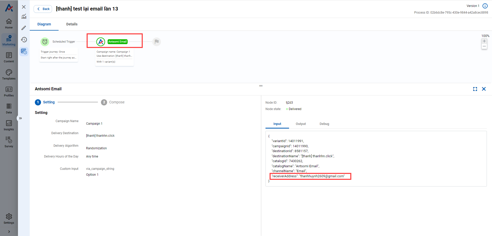

# How to test a Journey using Email channel?

## 1. Test the visualization of a Template

Use **Test** button in Email Template & Customer Journey:

### a. Email Template

* Go to Email Template app -> Choose the template you want to test

<figure><figcaption></figcaption></figure>

* Click **Test** button

<figure><figcaption></figcaption></figure>

* Fill the necessary information -> Click **SEND TEST**

<figure><figcaption></figcaption></figure>

### b. Customer Journeys

* Go to **Marketing** -> Choose **Email** channel -> Choose the journey you want to test

<figure><figcaption></figcaption></figure>

<figure><figcaption></figcaption></figure>

* Choose Destination node -> Go to step 2: Compose -> Click **Edit**

<figure><figcaption></figcaption></figure>

* Click **Test** button

<figure><figcaption></figcaption></figure>

* Fill the necessary information -> Click **SEND TEST**

<figure><figcaption></figcaption></figure>

<mark style="background-color:red;">NOTE: When testing the Template, you can input any email address you want</mark>

## 2. Test the Journey

There are two ways to test the journey:

### a. Change the audience in Trigger Node

* In the Journey you want to test, choose Trigger node&#x20;

-> Change the schedule of the Journey to:&#x20;

* Trigger Journey: Once
* Trigger Time: Right after the journey activated

<figure><figcaption></figcaption></figure>

-> Choose the specific customers who will receive the email

<figure><figcaption></figcaption></figure>

* Save & Activate the journey

<figure><figcaption></figcaption></figure>

### b. Use "Quick Test" in Destination node

* Choose "Destination node" --> Select Step 2: Compose --> Click "Quick Test"

<figure><figcaption></figcaption></figure>

* Select the audiences who will receive the message --> Click "RUN TEST"

<figure><figcaption></figcaption></figure>

<mark style="background-color:red;">**NOTE**</mark><mark style="background-color:red;">:</mark>&#x20;

* <mark style="background-color:red;">The list of audience here depends on the type of audiences selected in the Trigger node</mark>

<mark style="background-color:red;">-->  Eg: Trigger node (Customers) --> "Quick test" audience list (Customers)</mark>

* <mark style="background-color:red;">If you want to use your email to test the journey, your information MUST exists in the BO Visitor/Customer selected in Trigger node</mark>

## 3. Check the test results

### a. Open your mailbox to see if emails were sent or not

### b. Go to Schedule History tab of the Journey

* Each Schedule ID represent a time the Journey run. Click the ID to see further information

<figure><figcaption></figcaption></figure>

* After click on the Schedule ID --> Select _Detail_ tab&#x20;

Each Process ID represent an email address received the email. Click the ID to see detail

<figure><figcaption></figcaption></figure>

* Click the destination node if you want to know the email address of receiver

<figure><figcaption></figcaption></figure>

