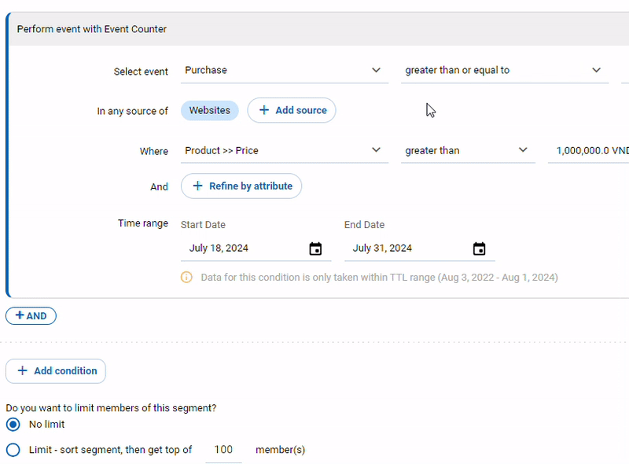

# How to create a new segment?

&#x20;1\. Log into the CDP 365 system. After logging in, look at the menu on the left hand side.

&#x20;2\. Hover your mouse over **Profiles**. Choose **Segments**.

<figure><figcaption></figcaption></figure>

&#x20;3\. Click **+** button

<figure><figcaption></figcaption></figure>

&#x20;4\. Choose segment type

<figure><figcaption></figcaption></figure>

&#x20;5\. Fill segment info

<figure><figcaption></figcaption></figure>

<table><thead><tr><th width="100">No</th><th width="167">Field</th><th>Description</th></tr></thead><tbody><tr><td>1</td><td>Audience Name</td><td>Name of segment</td></tr><tr><td>2</td><td>Description</td><td>Description makes it easier for others to understand</td></tr></tbody></table>

<figure><figcaption></figcaption></figure>

<table><thead><tr><th width="106">No</th><th>Field</th><th>Description</th></tr></thead><tbody><tr><td>3</td><td>Update Segment</td><td>
Users can set the need to update the audience list within a segment and cannot be changed after the segment is saved. 

 - Static Segment: Do not update the segment, only build/rebuild once after the segment is created/edited. 

 - Dynamic Segment: Scheduled segment updates set by the user 

   + Available options include: [1-23] hour(s), [1-365] day(s)
</td></tr></tbody></table>

<figure><figcaption></figcaption></figure>

<table><thead><tr><th width="111">No</th><th width="220">Field</th><th>Description</th></tr></thead><tbody><tr><td>4</td><td>Member input method</td><td>
When creating a static segment, the user needs to choose a method to build a list of members of this segment, specifically there are 2 methods: 

  - Conditions: Segment members will be selected through the conditions on audience's attributes &#x26; events 

  - Matching file: Segment members will be selected by matching audience's attributes with information from an uploaded file.
</td></tr></tbody></table>

&#x20;   **Member input method is Conditions**

<figure><figcaption></figcaption></figure>

<table><thead><tr><th width="98">No</th><th>Field</th><th>Description</th></tr></thead><tbody><tr><td>5</td><td>Include people that</td><td>The input conditions will be automatically generated according to the template and user edits on these conditions</td></tr></tbody></table>

&#x20;  When the user selects a condition type, the system will open an additional condition block with a UI corresponding to the selected condition type.

<figure><figcaption></figcaption></figure>

&#x20;    Description:&#x20;

&#x20;       1\. Button “AND” allows adding a condition block statement to the corresponding condition group. Up to 20 blocks/group&#x20;

&#x20;       2\. Button “OR” allows to create a new condition group and directly add the first condition block to that group. Up to 20 groups/segment&#x20;

&#x20;       3\. Button “AND” or “OR” conditions both allow user to select condition type

&#x20;   "**Include people that" - type: "Perform event"**

<figure><figcaption></figcaption></figure>

<figure><figcaption></figcaption></figure>

Description:&#x20;

&#x20;        1\. The user selects an event (event's display name) and enters an input comparison value, which is formatted according to the integer part of the portal preference/number format. For example, number format 1,234.56 → integer format: 1,234&#x20;

&#x20;        2\. After the user selects event → automatically selects all the sources where the event is logged at that time, the user can remove the unused sources. When you need to add a new source → Click 'Add source', in the list, the selected source will disable action add&#x20;

&#x20;        3\. Button ‘Refine by attribute': The user tweaks the input condition by clicking this button to open an additional sub-condition. Up to 20 sub-conditions. Note: when a business object is bound to an Event, its attribute will be displayed in the following format: \[Object name] >> \[Attribute name] for example: Product >> id, Province >> Name

<figure><figcaption></figcaption></figure>

&#x20;     Description:&#x20;

&#x20;       Time range: information calculation interval of event To use, the user clicks on the time range to open the calendar popup When the user selects the time range, a popup calendar will open for the user to select the durations to calculate:&#x20;

&#x20;        1\. If you want to customize, the user chooses Custom option to freely choose the duration of the form \[from date1 to date2]&#x20;

&#x20;        2\. Or choose specific predefined dynamic timelines with options: Today, Yesterday This week (Sun-Today) or This week (Mon-Today), Last 7 days (Note: implicitly NOT include Today), Last week (Sun-Sat), Last week (Mon-Sun), Last 14 days (Note: implicitly NOT include Today), This month (Note: implicitly include Today), Last 30 days (Note: implicitly NOT include Today), Last month Current quarter (Note: implicitly include Today), Last quarter x day(s) up to today, x day(s) up to yesterday

&#x20;   **Include people that - type: Have attribute**

<figure><figcaption></figcaption></figure>

&#x20;     Description: When comparing an attribute, if the operator allows input of multiple comparison values (match any/ not match any) → these values are displayed in a format that allows up to 3 specific values to be displayed, the remaining values are displayed. again in the form +\[x] more \[value 1], \[value 2], \[value 3], and +\[x] more

<figure><figcaption></figcaption></figure>

<table><thead><tr><th width="87">No</th><th width="190">Field</th><th>Description</th></tr></thead><tbody><tr><td>6</td><td>Segment Member</td><td>The user can choose the limitation type of segment. There are two types of limitation: No limit and Limit In Limit type, user can select number of members</td></tr></tbody></table>

&#x20;   **Forecast segment results**

<figure><figcaption></figcaption></figure>

&#x20;   **Member input method is "Matching file"**

<figure><figcaption></figcaption></figure>

Description:&#x20;

&#x20;       User need to upload file and install matching conditions.&#x20;

&#x20;       Click **+ Add criteria** button to map information of suitable audiences&#x20;

&#x20;       Update method:&#x20;

&#x20;         \- Replace the current audiences: This segment's list of current audiences will be reset, and replaced with audiences that meet the new mapping criteria&#x20;

&#x20;         \- Add more audiences: The current audience list of the segment will be preserved, and the audiences that the system finds through the mapping criteria of the new uploaded file will be merged (OR) with the current audiences list to create a new list of audiences for this segment.

6\. Click **Save** button to finish creating the Segment

&#x20;  Then you will be received success messages as:

<figure><figcaption></figcaption></figure>
