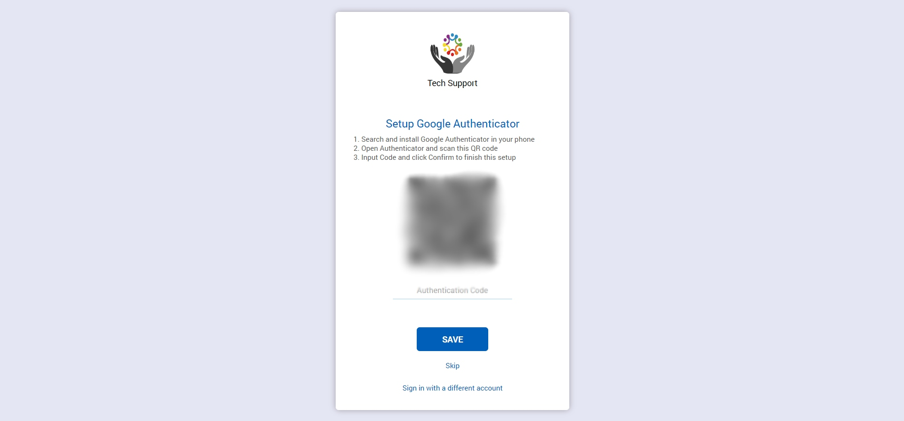
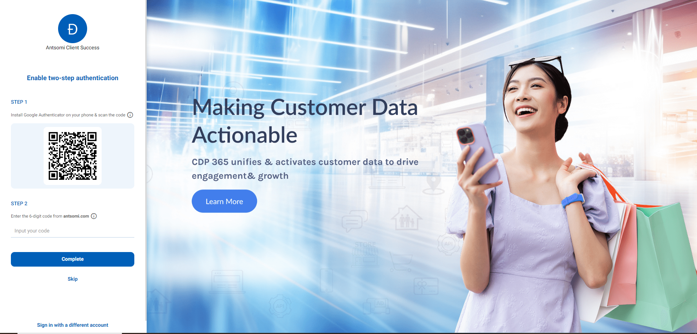

# How to set up two-step authentication?

In order to keep your account save and secure, you should enable two-step authentication. This will require a verification code every time you log in to CDP 365.

## Turn on two-step verification

There are three ways to turn it on:

1. Go to your _**Account Profile**_ --> Click _**Edit profile**_&#x20;

<figure><figcaption></figcaption></figure>

2. Go to _**Portal Settings**_ --> Choose _**Accounts**_ menu --> Select a specific account, it is located in _Summary_ tab. Turn it on by switching the button .png>)

<figure><figcaption></figcaption></figure>

2. Turn it on by setup directly after input login information

<figure><figcaption></figcaption></figure>

<figure><figcaption></figcaption></figure>

After entering your email and password, the system will always ask you whether to setup Google Authenticator or not.&#x20;

* If you do it here, it also means that two-step authentication is enabled.
* If you click _**Skip**_, this section is bypassed.&#x20;

<figure><figcaption>
Login options
</figcaption></figure>

## Setup two-step verification&#x20;

1\.     Search and install _**Google Authenticator**_ app on your phone. The app should look like this:

<figure><figcaption>
Google Authenticator
</figcaption></figure>

2\.     Click _**Scan a QR code**_ and scan the QR code provided by CDP 365 in Summary tab.

<figure><figcaption></figcaption></figure>

After scanning the QR Code, your account is added.

<figure><figcaption></figcaption></figure>

3\.    Enter the code from GG Authenticator to CDP 365

<figure><figcaption></figcaption></figure>

<figure><figcaption></figcaption></figure>

4\.    Click _**Complete**_

After following these steps, you are all set. Every time you log in to CDP 365, you must enter the code provide by Google Authenticator. This code will expire and change every 30 seconds.

<figure><figcaption></figcaption></figure>
