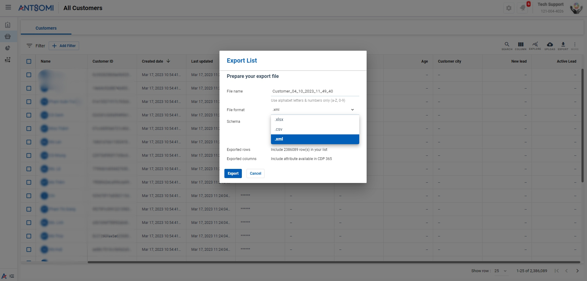
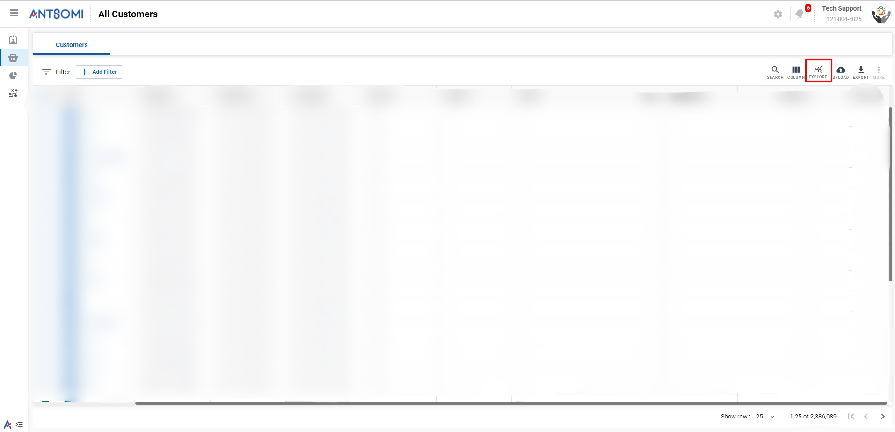
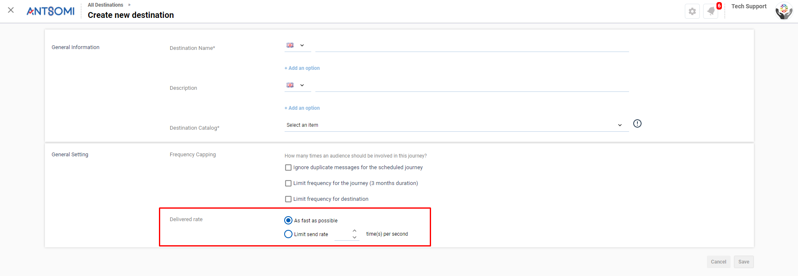

# March 2023

## FUNCTIONS & FEATURES

1. [Personas](march-2023.md#personas)

* [Export data in XML file type](march-2023.md#export-data-in-xml-file-type)
* [Explore in Visitors/Customers](march-2023.md#explore)

2. [Marketing Hub](march-2023.md#marketing-hub)

* [Customer Journey - Add Resume Times column](march-2023.md#customer-journey-resume-times-column)
* [Destinations - Delivered rate](march-2023.md#destination-delivered-rate)
* [Media Template - Auto Close, Verified Submit feature](march-2023.md#media-templates)
* [Email Templates](march-2023.md#email-templates)

3. [Insights - Reports](march-2023.md#insights-reports)
4. [Portal Settings -  Two-step authentication](march-2023.md#portal-settings-two-steps-authentication)

## DETAILS

### Personas

#### **Export data in XML file type**

You are now able to export the data in XML file type.  Furthermore, it also allows previewing the results of a specific schema and  saving a schema to be used in the future. This is applied to Visitors, Customers and Segment apps.&#x20;

[Read more](https://docs.antsomi.com/cdp-365-user-guide-en/use-cases/personas/segments/how-to-export-.xml-file)

<figure><figcaption>
Choose .xml option in File format dropdown list
</figcaption></figure>

#### **Explore**&#x20;

Explore function is now available in Visitors and Customers which provides you an overview and analysis of the data in Visitors/Customers.&#x20;

[Read more](https://docs.antsomi.com/cdp-365-user-guide-en/personas/visitors-and-customers#explore-visitors-customers)

<figure><figcaption></figcaption></figure>

### Marketing Hub&#x20;

#### **Customer Journey - Resume times column**

Resume times column is added in the data table of _Schedule history_ details and _Action history_ tab belonging to a specific Journey. The information in the column marks the time a Process is resumed which allows you easily filter the audiences which a Journey has failed to send out marketing messages.&#x20;

[Read more](https://docs.antsomi.com/cdp-365-user-guide-en/marketing-hub/customer-journeys/work-with-journey#action-history-or-schedule-history)

<figure><figcaption></figcaption></figure>

#### **Destination - Delivered rate**

Delivered rate setting allows users to limit the number of messages sent per second for a specific Destination.&#x20;

[Read more](https://docs.antsomi.com/cdp-365-user-guide-en/marketing-hub/destinations/all-destinations#general-setting)

<figure><figcaption></figcaption></figure>

#### **Media templates**

1. **Auto close**&#x20;

Auto Close feature located in the View Styling menu allows you to adjust the closing time of a template without using a Close button. With the level of Template, the whole template would be automatically closed after a set time no matter which view users are in. As for the other view level, the template would be closed after appearing in a set time.&#x20;

[Read more](https://docs.antsomi.com/cdp-365-user-guide-en/marketing-hub/media-template/settings/template-settings/basic#close-button-styling)

<figure><figcaption>
Auto Close feature
</figcaption></figure>

2. **Verified submit**&#x20;

Verified submit section in Limited submit setting allows users to authenticate the information input in Optin field according to the set condition. This means only people who enter valid information are able to move to the next action. Besides, users are able to customize the Error Message.

[Read more](https://docs.antsomi.com/cdp-365-user-guide-en/marketing-hub/media-template/settings/blocks-and-settings/optin-fields#verified-submit)

<figure><figcaption></figcaption></figure>

#### **Email Templates**&#x20;

From now on, there will be only one Email Templates app. And even though the old email template has been removed, all Journeys that have or are using templates created from the old feature would remain the old setting.

[Read more](https://docs.antsomi.com/cdp-365-user-guide-en/marketing-hub/media-template/settings/template-settings/basic#close-button-styling)

### Insights - Reports

You are now able to see who is viewing or editing a report at the same time as you by looking at their avatar on the top panel. Furthermore, when there are changes made during the time, the report would be updated and these changes are displayed immediately.

[Read more](https://docs.antsomi.com/cdp-365-user-guide-en/insights/reports/create-reports/about-reports#see-who-is-on-the-same-report-with-you)

### Portal Settings - **Two-steps authentication**&#x20;

In order to enable two-step authentication for an account, instead of going to Account Profile settings, users are now able to do it in the tab Summary when viewing a specific account details. To finish the setup, users have to follow the instructions and click Save.

[Read more](https://docs.antsomi.com/cdp-365-user-guide-en/use-cases/portal-settings/how-to-set-up-two-step-authentication)

\
\

