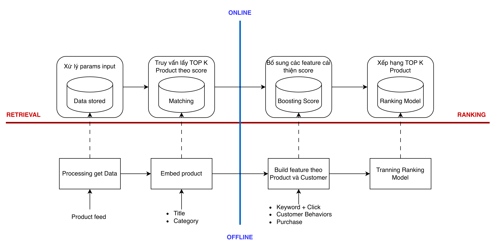

# System Search

Đối với các hệ thống **Search** , hầu hết các mô hình triển khai thực tế đều tuân theo một cấu trúc tương tự.\
Cụ thể, toàn bộ quy trình thường được chia thành hai trục chính:

* **Môi trường xử lý:** tách biệt giữa **offline** (huấn luyện, xây dựng dữ liệu nền) và **online** (xử lý truy vấn thời gian thực).
* **Giai đoạn xử lý:** bao gồm hai bước chính là **retrieval (truy xuất ứng viên)** và **ranking (xếp hạng kết quả)**.

Hình minh họa dưới đây mô tả mô hình “2 x 2” giúp đơn giản hóa và làm rõ cấu trúc này:

<figure><figcaption></figcaption></figure>

#### Môi trường Offline và Online trong hệ thống Search

**Môi trường&#x20;**_**offline**_ chủ yếu phục vụ các tiến trình xử lý theo lô (_batch processes_) như:

* **Huấn luyện mô hình** (ví dụ: , mô hình xếp hạng – _ranking_).
* **Sinh vector embedding** cho toàn bộ sản phẩm trong _catalog_.
* **Xây dựng chỉ mục lân cận gần ( Index)**  để tìm các item tương tự.
* **Tải dữ liệu item và Behavior Customer vào Feature Store**, nơi sẽ được dùng để bổ sung đặc trưng cho dữ liệu đầu vào trong giai đoạn xếp hạng.

**Môi trường&#x20;**_**online**_ sử dụng các “data” đã được tạo ra từ offline (như  Index, knowledge graph, mô hình, feature store) để phục vụ **các yêu cầu truy vấn thời gian thực** của người dùng.\
Quy trình điển hình gồm các bước:

1. **Chuyển truy vấn hoặc item đầu vào thành embedding**.
2. **Thực hiện truy xuất ứng viên (candidate retrieval)**.
3. **Tiến hành xếp hạng (ranking)**.

